# ERD Lógico Detallado — ERP Densa Niebla

**Versión:** ERD lógico v1.0
**Estado:** especificación para revisión y aprobación previa a los modelos SQLAlchemy
**Base:** ERD conceptual v1 + Avance del ERD + documento maestro de arquitectura
**Motor:** PostgreSQL 16 · SQLAlchemy 2.x · Alembic

Este documento define cada entidad con sus campos, tipos, claves, cardinalidades,
restricciones e índices. Es el insumo directo para escribir `app/models/`. No se debe
generar ninguna migración hasta que esté aprobado.

---

## Índice

0. [Convenciones globales](#0-convenciones-globales)
1. [Mapa de módulos y orden de dependencias](#1-mapa-de-módulos-y-orden-de-dependencias)
2. [Módulo Seguridad](#2-módulo-seguridad)
3. [Módulo Terceros](#3-módulo-terceros)
4. [Módulo Productos y Unidades](#4-módulo-productos-y-unidades)
5. [Módulo Precios y Comisiones](#5-módulo-precios-y-comisiones)
6. [Módulo Compras](#6-módulo-compras)
7. [Módulo Inventario y Lotes](#7-módulo-inventario-y-lotes)
8. [Módulo Producción](#8-módulo-producción)
9. [Módulo Costos](#9-módulo-costos)
10. [Módulo Ventas y Pagos](#10-módulo-ventas-y-pagos)
11. [Módulo Facturación DIAN](#11-módulo-facturación-dian)
12. [Módulo Logística](#12-módulo-logística)
13. [Módulo Gastos](#13-módulo-gastos)
14. [Módulo Configuración](#14-módulo-configuración)
15. [Resumen de índices](#15-resumen-de-índices)
16. [Decisiones cerradas y decisiones abiertas](#16-decisiones-cerradas-y-decisiones-abiertas)
17. [Orden de la migración inicial](#17-orden-de-la-migración-inicial)

---

## 0. Convenciones globales

### 0.1 Nomenclatura

Se cierra el glosario que estaba divergente entre el ERD conceptual y el avance. Estos
son los nombres canónicos, y no deben cambiar una vez generada la migración inicial.

| Concepto | Nombre canónico | Nombres descartados |
|---|---|---|
| Orden de producción | `production_orders` | `production` |
| Reglas de costo | `cost_rules` | `process_cost_rules` |
| Comisiones de intermediario | `intermediary_fee_rules` + `intermediary_fee_entries` | `intermediary_fees` |
| Merma | `production_waste` | `waste` |
| Tercero | `parties` | `customers`, `suppliers`, `cafeterias` |

Reglas: tablas en `snake_case` plural y en inglés; columnas en `snake_case` inglés;
claves foráneas con sufijo `_id`; booleanos con prefijo `is_` o `has_`; fechas con
sufijo `_date` (solo fecha) o `_at` (fecha y hora); montos con sufijo `_amount`,
`_price`, `_cost` o `_total`.

### 0.2 Tipos de dato

| Uso | Tipo | Justificación |
|---|---|---|
| Clave primaria | `BIGINT` identity | Nunca `INTEGER`: los movimientos de inventario crecen rápido y migrar a 64 bits después es costoso |
| Montos de dinero | `NUMERIC(16,2)` | El peso colombiano no tiene centavos en operación, pero los cálculos intermedios sí. **Nunca `FLOAT`** |
| Cantidades | `NUMERIC(16,4)` | Cuatro decimales soportan gramos expresados en libras sin pérdida material |
| Tarifas y precios unitarios | `NUMERIC(16,4)` | Un precio por libra puede tener fracciones al derivarse de un precio por kg |
| Factores de conversión | `NUMERIC(20,10)` | Las conversiones se multiplican en cadena; el error se acumula |
| Porcentajes | `NUMERIC(9,6)` | Almacenados como fracción (0.19 = 19%), no como 19 |
| Fecha y hora | `TIMESTAMP WITH TIME ZONE` | Obligatorio. Sin zona, cualquier reporte cruzando medianoche en `America/Bogota` queda mal |
| Fecha contable | `DATE` | Fechas de documento no llevan hora |
| Texto corto identificador | `VARCHAR(n)` con límite explícito | Los códigos tienen longitud conocida |
| Texto libre | `TEXT` | Sin límite artificial |
| Estados y tipos | `VARCHAR(n)` + `CHECK` | **No se usa `ENUM` nativo de Postgres**: agregar un valor a un `ENUM` requiere DDL y no se puede revertir dentro de una transacción en versiones antiguas; un `CHECK` se recrea sin drama |
| Datos semiestructurados | `JSONB` | Solo para respuestas de la DIAN y payloads de auditoría, nunca para datos consultables del negocio |

### 0.3 Columnas de auditoría

Todas las tablas de negocio incluyen:

```
created_at    TIMESTAMPTZ  NOT NULL  DEFAULT now()
updated_at    TIMESTAMPTZ  NOT NULL  DEFAULT now()
created_by_id BIGINT       NULL      FK -> users.id  ON DELETE SET NULL
updated_by_id BIGINT       NULL      FK -> users.id  ON DELETE SET NULL
```

Se implementan en una clase mixin `TimestampMixin` / `AuditMixin` para no repetirlas en
cada modelo. `updated_at` se mantiene con `onupdate=func.now()` en SQLAlchemy.

Las tablas de catálogo (unidades, categorías, impuestos) llevan solo `created_at` y
`updated_at`.

### 0.4 Borrado

No se borra nada que participe en un cálculo histórico. Las tablas de catálogo y
maestras usan `is_active BOOLEAN NOT NULL DEFAULT TRUE` para desactivación lógica. Las
tablas transaccionales usan estados (`status`) y, cuando aplica, anulación mediante
documento inverso.

`ON DELETE` por defecto es `RESTRICT`. Se usa `CASCADE` únicamente de cabecera a
detalle dentro del mismo documento (por ejemplo `sales` → `sale_items`), y
`SET NULL` solo en referencias de auditoría.

### 0.5 Vigencias

Toda tabla de reglas (precios, costos, comisiones) usa el par:

```
valid_from DATE NOT NULL
valid_to   DATE NULL          -- NULL = vigente indefinidamente
CHECK (valid_to IS NULL OR valid_to >= valid_from)
```

Una regla **nunca se actualiza para cambiar su valor**. Se cierra con `valid_to` y se
crea una nueva. Así el costo de una tostión de marzo sigue siendo el de marzo aunque la
tarifa suba en abril, que es exactamente la regla que exige el ERD conceptual.

Para impedir solapamientos a nivel de base de datos se usa una restricción de exclusión
con `btree_gist`:

```sql
CREATE EXTENSION IF NOT EXISTS btree_gist;

ALTER TABLE cost_rules ADD CONSTRAINT cost_rules_no_overlap
EXCLUDE USING gist (
    process_id WITH =,
    executor_party_id WITH =,
    product_id WITH =,
    daterange(valid_from, COALESCE(valid_to, 'infinity'::date), '[]') WITH &&
);
```

Esta extensión debe habilitarse en la primera migración, antes de crear las tablas de
reglas. En Heroku Postgres `btree_gist` está disponible sin permisos especiales.

### 0.6 Redondeo y moneda

Moneda operativa: `COP`. Aunque hoy solo exista una, todas las tablas con monto llevan
`currency CHAR(3) NOT NULL DEFAULT 'COP'`: agregarla después obliga a rellenar
históricos.

El redondeo se aplica **solo al total de línea y al total de documento**, nunca a los
cálculos intermedios, y se centraliza en un único helper en la capa de servicios. Los
totales de cabecera son valores materializados (no calculados al vuelo) porque son
snapshots del documento en el momento de su emisión.

### 0.7 Convención de nombres de restricciones

Se define una `naming_convention` en los metadatos de SQLAlchemy. Sin esto, Alembic
genera nombres de restricción implícitos que PostgreSQL asigna arbitrariamente, y
después es imposible escribir una migración que los altere.

```python
NAMING_CONVENTION = {
    "ix": "ix_%(column_0_label)s",
    "uq": "uq_%(table_name)s_%(column_0_name)s",
    "ck": "ck_%(table_name)s_%(constraint_name)s",
    "fk": "fk_%(table_name)s_%(column_0_name)s_%(referred_table_name)s",
    "pk": "pk_%(table_name)s",
}
```

Debe declararse **antes** de generar la migración inicial. Añadirlo después no renombra
lo ya creado.

---

## 1. Mapa de módulos y orden de dependencias

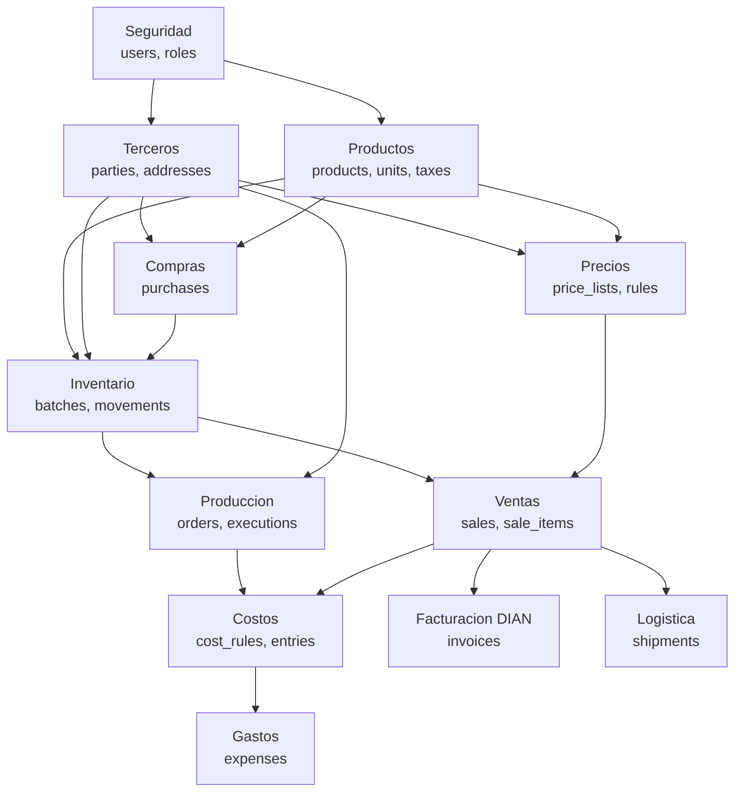

El orden de creación de tablas en la migración inicial debe respetar este grafo. Las 11
tablas de catálogo puro, que no dependen de ninguna otra, se crean primero: `users`,
`roles`, `units_of_measure`, `taxes`, `product_categories`, `expense_categories`,
`cost_categories`, `production_processes`, `app_settings`, `document_sequences` y
`fiscal_resolutions`. El detalle migración por migración está en la sección 17.

### Conteo de entidades

| Módulo | Tablas |
|---|---|
| Seguridad | 3 |
| Terceros | 4 |
| Productos y Unidades | 6 |
| Precios y Comisiones | 5 |
| Compras | 2 |
| Inventario y Lotes | 5 |
| Producción | 6 |
| Costos | 3 |
| Ventas y Pagos | 5 |
| Facturación DIAN | 4 |
| Logística | 3 |
| Gastos | 2 |
| Configuración | 2 |
| **Total** | **50** |

---

## 2. Módulo Seguridad

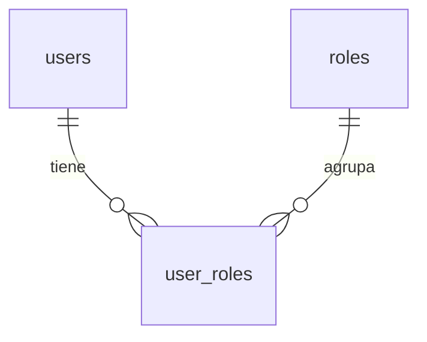

### 2.1 `users`

Usuarios internos del sistema. No confundir con `parties`: un usuario es quien opera el
ERP; una party es un tercero del negocio. Un empleado que además compra café tendría
registro en ambas tablas, vinculadas por `party_id`.

| Columna | Tipo | Nulo | Restricción / Nota |
|---|---|---|---|
| `id` | BIGINT | NO | PK |
| `email` | VARCHAR(255) | NO | UNIQUE, almacenado en minúsculas |
| `password_hash` | VARCHAR(255) | NO | Werkzeug `scrypt` o `pbkdf2:sha256` |
| `full_name` | VARCHAR(150) | NO | |
| `party_id` | BIGINT | SÍ | FK → `parties.id`, ON DELETE SET NULL. Vincula el usuario con su tercero si aplica |
| `is_active` | BOOLEAN | NO | DEFAULT TRUE. Desactivar en lugar de borrar |
| `is_superuser` | BOOLEAN | NO | DEFAULT FALSE |
| `last_login_at` | TIMESTAMPTZ | SÍ | |
| `failed_login_count` | SMALLINT | NO | DEFAULT 0 |
| `locked_until` | TIMESTAMPTZ | SÍ | Bloqueo temporal por intentos fallidos |
| `password_changed_at` | TIMESTAMPTZ | SÍ | |
| Auditoría | | | `created_at`, `updated_at` |

Índices: `uq_users_email` UNIQUE(`email`); `ix_users_is_active`(`is_active`).

### 2.2 `roles`

| Columna | Tipo | Nulo | Restricción / Nota |
|---|---|---|---|
| `id` | BIGINT | NO | PK |
| `code` | VARCHAR(40) | NO | UNIQUE. `ADMIN`, `VENTAS`, `PRODUCCION`, `INVENTARIO`, `CONTABILIDAD`, `CONSULTA` |
| `name` | VARCHAR(100) | NO | |
| `description` | TEXT | SÍ | |
| `permissions` | JSONB | NO | DEFAULT `'[]'`. Lista de códigos de permiso |
| `is_system` | BOOLEAN | NO | DEFAULT FALSE. Los roles de sistema no se pueden borrar |
| Auditoría | | | `created_at`, `updated_at` |

Se usa `JSONB` para permisos en lugar de tablas `permissions` + `role_permissions`. Es
una decisión deliberada: con seis roles y un solo operador principal, una matriz
relacional de permisos es sobreingeniería. Si el equipo crece y se necesitan permisos
granulares por módulo, la migración a tablas relacionales es directa.

### 2.3 `user_roles`

| Columna | Tipo | Nulo | Restricción / Nota |
|---|---|---|---|
| `id` | BIGINT | NO | PK |
| `user_id` | BIGINT | NO | FK → `users.id`, ON DELETE CASCADE |
| `role_id` | BIGINT | NO | FK → `roles.id`, ON DELETE RESTRICT |
| `assigned_at` | TIMESTAMPTZ | NO | DEFAULT now() |
| `assigned_by_id` | BIGINT | SÍ | FK → `users.id` |

Restricción: UNIQUE(`user_id`, `role_id`).

---

## 3. Módulo Terceros

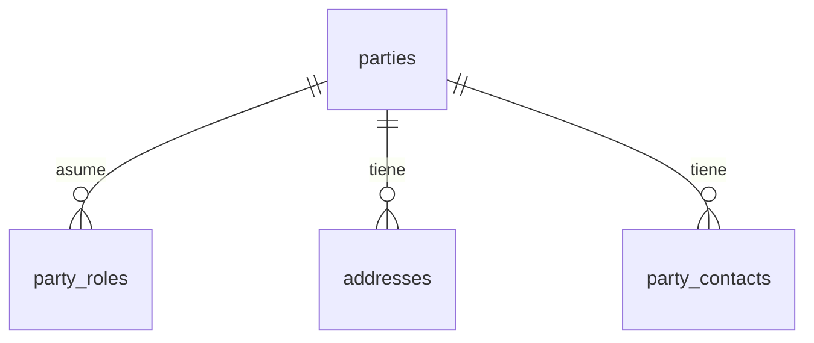

Este módulo materializa la regla de diseño más importante del ERD conceptual: no
separar clientes, cafeterías, proveedores e intermediarios en tablas independientes.
Una cafetería que además le vende café verde a Densa Niebla es **una sola party con dos
roles**, no dos registros duplicados.

### 3.1 `parties`

| Columna | Tipo | Nulo | Restricción / Nota |
|---|---|---|---|
| `id` | BIGINT | NO | PK |
| `party_type` | VARCHAR(20) | NO | CHECK IN (`NATURAL`, `JURIDICA`) |
| `document_type` | VARCHAR(10) | NO | CHECK IN (`CC`,`NIT`,`CE`,`PAS`,`TI`,`RC`,`PEP`,`NIT_EXT`). Códigos DIAN |
| `document_number` | VARCHAR(30) | NO | Solo dígitos y letras, sin puntos ni guiones |
| `verification_digit` | SMALLINT | SÍ | Dígito de verificación del NIT. Obligatorio si `document_type='NIT'` |
| `legal_name` | VARCHAR(200) | NO | Razón social o nombre completo |
| `trade_name` | VARCHAR(200) | SÍ | Nombre comercial |
| `first_name` | VARCHAR(100) | SÍ | Para personas naturales, requerido por la DIAN por separado |
| `last_name` | VARCHAR(100) | SÍ | |
| `email` | VARCHAR(255) | SÍ | Obligatorio para envío de factura electrónica |
| `phone` | VARCHAR(30) | SÍ | |
| `whatsapp` | VARCHAR(30) | SÍ | Canal real de contacto con cafeterías y campesinos |
| `tax_regime` | VARCHAR(30) | SÍ | CHECK IN (`SIMPLIFICADO`,`COMUN`,`GRAN_CONTRIBUYENTE`,`NO_RESPONSABLE_IVA`,`REGIMEN_SIMPLE`) |
| `tax_responsibilities` | JSONB | NO | DEFAULT `'[]'`. Códigos de responsabilidad fiscal DIAN (O-13, O-15, O-23, R-99-PN) |
| `is_vat_withholding_agent` | BOOLEAN | NO | DEFAULT FALSE |
| `municipality_code` | VARCHAR(5) | SÍ | Código DANE del municipio |
| `department_code` | VARCHAR(2) | SÍ | Código DANE del departamento |
| `country_code` | CHAR(2) | NO | DEFAULT `'CO'`, ISO 3166-1 alfa-2 |
| `credit_limit` | NUMERIC(16,2) | SÍ | Límite de crédito. NULL = sin crédito |
| `payment_term_days` | SMALLINT | NO | DEFAULT 0. 0 = contado |
| `default_price_list_id` | BIGINT | SÍ | FK → `price_lists.id`, ON DELETE SET NULL |
| `notes` | TEXT | SÍ | |
| `is_active` | BOOLEAN | NO | DEFAULT TRUE |
| Auditoría | | | Completa |

Restricciones:

- UNIQUE(`document_type`, `document_number`)
- CHECK: `document_type <> 'NIT' OR verification_digit IS NOT NULL`
- CHECK: `party_type <> 'NATURAL' OR (first_name IS NOT NULL AND last_name IS NOT NULL)`

Índices: `ix_parties_legal_name` (búsqueda con `ILIKE`, considerar `pg_trgm` cuando el
volumen lo justifique); `ix_parties_is_active`; `ix_parties_document_number`.

**Nota sobre datos fiscales.** Los campos `tax_regime`, `tax_responsibilities` e
`is_vat_withholding_agent` existen porque la factura electrónica los exige en el XML.
Los valores concretos aplicables a Densa Niebla y a sus clientes debe confirmarlos el
área legal; el modelo solo garantiza que haya dónde guardarlos.

### 3.2 `party_roles`

| Columna | Tipo | Nulo | Restricción / Nota |
|---|---|---|---|
| `id` | BIGINT | NO | PK |
| `party_id` | BIGINT | NO | FK → `parties.id`, ON DELETE CASCADE |
| `role_code` | VARCHAR(30) | NO | CHECK IN (`CUSTOMER`,`SUPPLIER`,`COFFEE_GROWER`,`CAFETERIA`,`INTERMEDIARY`,`CARRIER`,`PROCESSOR`,`EMPLOYEE`) |
| `valid_from` | DATE | NO | DEFAULT CURRENT_DATE |
| `valid_to` | DATE | SÍ | NULL = rol activo |
| `notes` | TEXT | SÍ | |
| Auditoría | | | `created_at`, `updated_at` |

Restricciones: UNIQUE(`party_id`, `role_code`, `valid_from`); CHECK de vigencia.

Los ocho roles cubren la operación descrita: `COFFEE_GROWER` distingue al campesino
productor del proveedor genérico de insumos, `PROCESSOR` identifica al maquilador de
trilla o tostión, y `CARRIER` al transportador. Un mismo tercero puede ser
`COFFEE_GROWER` y `CUSTOMER` a la vez.

Índice: `ix_party_roles_role_code`(`role_code`, `valid_to`) para resolver rápido
"todos los clientes activos".

### 3.3 `addresses`

| Columna | Tipo | Nulo | Restricción / Nota |
|---|---|---|---|
| `id` | BIGINT | NO | PK |
| `party_id` | BIGINT | NO | FK → `parties.id`, ON DELETE CASCADE |
| `label` | VARCHAR(60) | SÍ | "Bodega principal", "Finca La Esperanza" |
| `address_type` | VARCHAR(20) | NO | CHECK IN (`BILLING`,`SHIPPING`,`BOTH`,`FARM`). DEFAULT `BOTH` |
| `address_line` | VARCHAR(255) | NO | |
| `address_line_2` | VARCHAR(255) | SÍ | Vereda, corregimiento, indicaciones |
| `municipality_code` | VARCHAR(5) | SÍ | Código DANE |
| `municipality_name` | VARCHAR(100) | NO | |
| `department_code` | VARCHAR(2) | SÍ | |
| `department_name` | VARCHAR(100) | NO | |
| `country_code` | CHAR(2) | NO | DEFAULT `'CO'` |
| `postal_code` | VARCHAR(10) | SÍ | |
| `latitude` | NUMERIC(10,7) | SÍ | Útil para fincas sin dirección formal y para trazabilidad de origen |
| `longitude` | NUMERIC(10,7) | SÍ | |
| `is_primary` | BOOLEAN | NO | DEFAULT FALSE |
| `is_active` | BOOLEAN | NO | DEFAULT TRUE |
| Auditoría | | | `created_at`, `updated_at` |

Restricción: índice único parcial que garantiza una sola dirección principal por
tercero.

```sql
CREATE UNIQUE INDEX uq_addresses_one_primary
ON addresses (party_id) WHERE is_primary;
```

El tipo `FARM` y las coordenadas resuelven un caso real del negocio: las fincas de los
campesinos frecuentemente no tienen dirección postal utilizable, y la ubicación es dato
de trazabilidad, no solo de contacto.

### 3.4 `party_contacts`

Personas de contacto dentro de una organización. Relevante para cafeterías, donde quien
hace el pedido no es quien paga ni quien recibe.

| Columna | Tipo | Nulo | Restricción / Nota |
|---|---|---|---|
| `id` | BIGINT | NO | PK |
| `party_id` | BIGINT | NO | FK → `parties.id`, ON DELETE CASCADE |
| `full_name` | VARCHAR(150) | NO | |
| `position` | VARCHAR(100) | SÍ | |
| `email` | VARCHAR(255) | SÍ | |
| `phone` | VARCHAR(30) | SÍ | |
| `is_primary` | BOOLEAN | NO | DEFAULT FALSE |
| `is_active` | BOOLEAN | NO | DEFAULT TRUE |
| Auditoría | | | `created_at`, `updated_at` |

---

## 4. Módulo Productos y Unidades

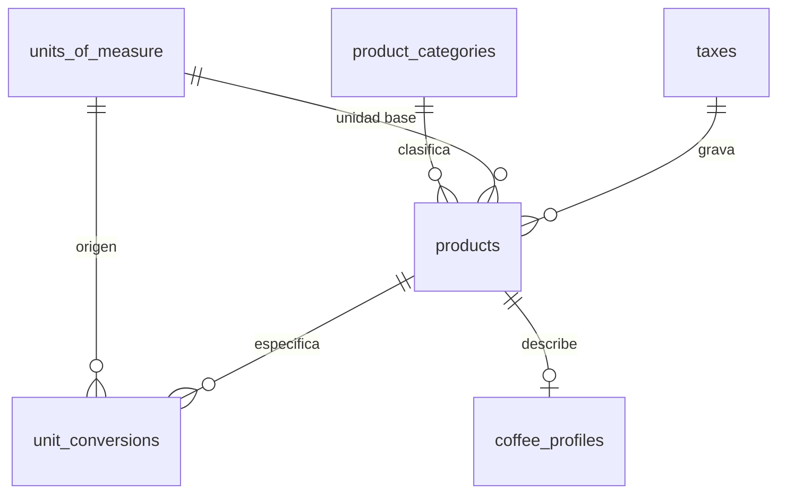

### 4.1 `units_of_measure`

| Columna | Tipo | Nulo | Restricción / Nota |
|---|---|---|---|
| `id` | BIGINT | NO | PK |
| `code` | VARCHAR(15) | NO | UNIQUE. `KG`, `LB`, `G`, `ARROBA`, `CARGA`, `SACO`, `UN`, `CAJA`, `HORA` |
| `name` | VARCHAR(60) | NO | |
| `dimension` | VARCHAR(20) | NO | CHECK IN (`MASS`,`COUNT`,`VOLUME`,`TIME`) |
| `is_base_for_dimension` | BOOLEAN | NO | DEFAULT FALSE. Exactamente una unidad base por dimensión |
| `decimal_places` | SMALLINT | NO | DEFAULT 3. Presentación, no almacenamiento |
| `dian_code` | VARCHAR(10) | SÍ | Código UNECE Rec 20 requerido en el XML de factura |
| `is_active` | BOOLEAN | NO | DEFAULT TRUE |
| Auditoría | | | `created_at`, `updated_at` |

Restricción: índice único parcial `uq_uom_one_base_per_dimension` ON (`dimension`)
WHERE `is_base_for_dimension`.

Unidades base propuestas: `KG` para masa, `UN` para conteo, `HORA` para tiempo.

### 4.2 `unit_conversions`

Esta tabla resuelve el vacío que señalé en el análisis: compras en arrobas o cargas,
produces en libras terminadas y vendes en bolsas de 340 g o 500 g. Sin factores
explícitos, el costo por libra y el inventario divergen.

| Columna | Tipo | Nulo | Restricción / Nota |
|---|---|---|---|
| `id` | BIGINT | NO | PK |
| `from_unit_id` | BIGINT | NO | FK → `units_of_measure.id`, ON DELETE RESTRICT |
| `to_unit_id` | BIGINT | NO | FK → `units_of_measure.id`, ON DELETE RESTRICT |
| `factor` | NUMERIC(20,10) | NO | `cantidad_to = cantidad_from * factor`. CHECK > 0 |
| `product_id` | BIGINT | SÍ | FK → `products.id`, ON DELETE CASCADE. NULL = conversión universal |
| `notes` | TEXT | SÍ | |
| `is_active` | BOOLEAN | NO | DEFAULT TRUE |
| Auditoría | | | `created_at`, `updated_at` |

Restricciones:

- UNIQUE(`from_unit_id`, `to_unit_id`, `product_id`) — con `product_id` NULL tratado como valor distinto vía índice único parcial
- CHECK: `from_unit_id <> to_unit_id`

El `product_id` nulable es la pieza clave. Hay dos clases de conversión:

**Universales** (`product_id` NULL): 1 KG = 2.2046226218 LB, 1 ARROBA = 12.5 KG,
1 CARGA = 125 KG, 1 SACO = 70 KG.

**Específicas de producto** (`product_id` con valor): 1 UN de "Café molido bolsa 340 g"
= 0.34 KG. Esta conversión no tiene sentido universal — depende del empaque.

> Los factores de arroba, carga y saco corresponden al uso convencional del sector
> cafetero colombiano y quedan **pendientes de confirmación** con administración: en la
> práctica regional la arroba de café pergamino y la de café verde pueden manejarse con
> equivalencias distintas, y el saco de exportación estándar es de 70 kg mientras el de
> uso interno suele ser de 60 kg. Es un dato de negocio, no técnico, y va en la lista de
> validación.

La resolución de conversiones se hace en la capa de servicios con un algoritmo de
búsqueda: primero conversión directa específica del producto, luego directa universal,
luego indirecta pasando por la unidad base de la dimensión. Si no existe camino, se
lanza excepción — **nunca se asume factor 1**.

### 4.3 `product_categories`

| Columna | Tipo | Nulo | Restricción / Nota |
|---|---|---|---|
| `id` | BIGINT | NO | PK |
| `code` | VARCHAR(30) | NO | UNIQUE |
| `name` | VARCHAR(100) | NO | |
| `parent_id` | BIGINT | SÍ | FK → `product_categories.id`, ON DELETE RESTRICT. Autorreferencia |
| `is_active` | BOOLEAN | NO | DEFAULT TRUE |
| Auditoría | | | `created_at`, `updated_at` |

Jerarquía de un nivel o dos como máximo. No se implementa árbol con `ltree`: la
complejidad no se justifica.

### 4.4 `taxes`

| Columna | Tipo | Nulo | Restricción / Nota |
|---|---|---|---|
| `id` | BIGINT | NO | PK |
| `code` | VARCHAR(20) | NO | UNIQUE. `IVA_0`, `IVA_5`, `IVA_19`, `INC_8`, `EXCLUIDO`, `EXENTO` |
| `name` | VARCHAR(80) | NO | |
| `tax_type` | VARCHAR(20) | NO | CHECK IN (`IVA`,`INC`,`RETEFUENTE`,`RETEIVA`,`RETEICA`,`NONE`) |
| `rate` | NUMERIC(9,6) | NO | Fracción: 0.19 = 19%. CHECK >= 0 |
| `dian_code` | VARCHAR(10) | SÍ | Código del tributo en el XML DIAN |
| `is_withholding` | BOOLEAN | NO | DEFAULT FALSE |
| `valid_from` | DATE | NO | Las tarifas cambian por reforma tributaria |
| `valid_to` | DATE | SÍ | |
| `is_active` | BOOLEAN | NO | DEFAULT TRUE |
| Auditoría | | | `created_at`, `updated_at` |

`valid_from` / `valid_to` no son opcionales aquí: cuando cambie una tarifa, las facturas
emitidas antes deben seguir mostrando la tarifa vigente a su fecha.

**Las tarifas concretas aplicables al café** —si el café tostado está gravado, exento o
excluido, y con qué porcentaje según presentación— las define el área legal. El modelo
no las presume.

### 4.5 `products`

| Columna | Tipo | Nulo | Restricción / Nota |
|---|---|---|---|
| `id` | BIGINT | NO | PK |
| `sku` | VARCHAR(40) | NO | UNIQUE |
| `name` | VARCHAR(200) | NO | |
| `description` | TEXT | SÍ | |
| `product_kind` | VARCHAR(25) | NO | CHECK IN (`FINISHED`,`RAW_MATERIAL`,`SEMI_FINISHED`,`SUPPLY`,`SERVICE`) |
| `category_id` | BIGINT | SÍ | FK → `product_categories.id`, ON DELETE SET NULL |
| `base_unit_id` | BIGINT | NO | FK → `units_of_measure.id`, ON DELETE RESTRICT |
| `sales_unit_id` | BIGINT | SÍ | FK → `units_of_measure.id`. Unidad por defecto al vender |
| `purchase_unit_id` | BIGINT | SÍ | FK → `units_of_measure.id`. Unidad por defecto al comprar |
| `tax_id` | BIGINT | SÍ | FK → `taxes.id`, ON DELETE RESTRICT |
| `tracks_batches` | BOOLEAN | NO | DEFAULT TRUE. FALSE para insumos como etiquetas o bolsas |
| `costing_method` | VARCHAR(25) | NO | CHECK IN (`SPECIFIC_BATCH`,`WEIGHTED_AVERAGE`,`SYSTEM_DEFAULT`). DEFAULT `SYSTEM_DEFAULT` |
| `is_sellable` | BOOLEAN | NO | DEFAULT TRUE |
| `is_purchasable` | BOOLEAN | NO | DEFAULT FALSE |
| `is_produced` | BOOLEAN | NO | DEFAULT FALSE |
| `min_stock` | NUMERIC(16,4) | SÍ | Alerta de reposición, en unidad base |
| `weight_kg` | NUMERIC(16,4) | SÍ | Peso unitario para cálculo de flete |
| `barcode` | VARCHAR(50) | SÍ | UNIQUE cuando no es NULL |
| `image_path` | VARCHAR(255) | SÍ | |
| `is_active` | BOOLEAN | NO | DEFAULT TRUE |
| Auditoría | | | Completa |

Restricciones:

- CHECK: `tracks_batches = FALSE OR product_kind <> 'SERVICE'`
- CHECK: al menos uno de `is_sellable`, `is_purchasable`, `is_produced` en TRUE
- Índice único parcial en `barcode` WHERE `barcode IS NOT NULL`

Índices: `ix_products_product_kind`; `ix_products_is_active`; `ix_products_sku`.

La columna `costing_method` es la implementación directa de tu decisión de costeo dual.
El valor `SYSTEM_DEFAULT` delega en la configuración global (`app_settings`), de modo
que puedes tener el sistema en promedio ponderado y marcar solo los cafés de origen
único como `SPECIFIC_BATCH`. El detalle de ambos algoritmos está en la sección 9.

### 4.6 `coffee_profiles`

Relación 1:1 opcional con `products`. Atributos que solo aplican al café y que no tiene
sentido meter como columnas nulables en `products`.

| Columna | Tipo | Nulo | Restricción / Nota |
|---|---|---|---|
| `id` | BIGINT | NO | PK |
| `product_id` | BIGINT | NO | FK → `products.id`, ON DELETE CASCADE, **UNIQUE** |
| `variety` | VARCHAR(80) | SÍ | Castillo, Caturra, Colombia, Geisha, Bourbon |
| `process_method` | VARCHAR(30) | SÍ | CHECK IN (`LAVADO`,`HONEY`,`NATURAL`,`ANAEROBICO`,`OTRO`) |
| `roast_level` | VARCHAR(20) | SÍ | CHECK IN (`CLARO`,`MEDIO`,`MEDIO_OSCURO`,`OSCURO`) |
| `grind_type` | VARCHAR(20) | SÍ | CHECK IN (`GRANO`,`GRUESO`,`MEDIO`,`FINO`,`EXPRESO`) |
| `altitude_min_masl` | INTEGER | SÍ | |
| `altitude_max_masl` | INTEGER | SÍ | |
| `cupping_score` | NUMERIC(5,2) | SÍ | Escala SCA, CHECK entre 0 y 100 |
| `sensory_notes` | TEXT | SÍ | Notas de taza |
| `packaging_grams` | NUMERIC(10,2) | SÍ | Gramaje del empaque |
| Auditoría | | | `created_at`, `updated_at` |

El `UNIQUE` sobre `product_id` es lo que convierte la relación en 1:1 real y no en 1:N
por accidente.
---

## 5. Módulo Precios y Comisiones

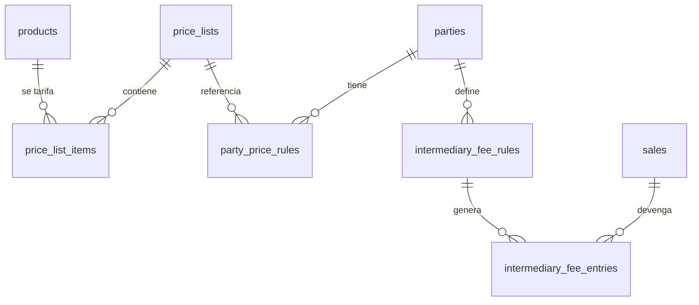

El ERD conceptual exige que "las tarifas generales y las condiciones particulares estén
desacopladas". Eso se logra con dos tablas separadas: `price_list_items` para la tarifa
general y `party_price_rules` para la excepción por tercero.

### 5.1 `price_lists`

| Columna | Tipo | Nulo | Restricción / Nota |
|---|---|---|---|
| `id` | BIGINT | NO | PK |
| `code` | VARCHAR(30) | NO | UNIQUE |
| `name` | VARCHAR(100) | NO | |
| `channel` | VARCHAR(25) | NO | CHECK IN (`RETAIL`,`CAFETERIA`,`WHOLESALE`,`INTERMEDIARY`,`EXPORT`,`INTERNAL`) |
| `currency` | CHAR(3) | NO | DEFAULT `'COP'` |
| `includes_tax` | BOOLEAN | NO | DEFAULT FALSE. Si TRUE, los precios son con IVA incluido |
| `is_default` | BOOLEAN | NO | DEFAULT FALSE |
| `valid_from` | DATE | NO | |
| `valid_to` | DATE | SÍ | |
| `is_active` | BOOLEAN | NO | DEFAULT TRUE |
| `notes` | TEXT | SÍ | |
| Auditoría | | | Completa |

Restricciones: CHECK de vigencia; índice único parcial `uq_price_lists_one_default` ON
(`channel`) WHERE `is_default AND is_active`.

`includes_tax` no es un detalle menor: al cliente final se le cotiza con IVA incluido y
a la cafetería sin IVA. Si el sistema no sabe qué representa el número almacenado, los
totales quedan mal en uno de los dos canales.

### 5.2 `price_list_items`

| Columna | Tipo | Nulo | Restricción / Nota |
|---|---|---|---|
| `id` | BIGINT | NO | PK |
| `price_list_id` | BIGINT | NO | FK → `price_lists.id`, ON DELETE CASCADE |
| `product_id` | BIGINT | NO | FK → `products.id`, ON DELETE RESTRICT |
| `unit_id` | BIGINT | NO | FK → `units_of_measure.id`, ON DELETE RESTRICT |
| `unit_price` | NUMERIC(16,4) | NO | CHECK >= 0 |
| `min_quantity` | NUMERIC(16,4) | NO | DEFAULT 0. Habilita precios por volumen |
| `max_quantity` | NUMERIC(16,4) | SÍ | NULL = sin techo |
| `valid_from` | DATE | NO | |
| `valid_to` | DATE | SÍ | |
| `is_active` | BOOLEAN | NO | DEFAULT TRUE |
| Auditoría | | | Completa |

Restricciones:

- CHECK: `max_quantity IS NULL OR max_quantity >= min_quantity`
- CHECK de vigencia
- Exclusión de solapamiento por (`price_list_id`, `product_id`, `unit_id`, rango de cantidad, rango de fechas)

Índice compuesto de resolución: `ix_price_list_items_lookup`(`price_list_id`,
`product_id`, `valid_from`, `valid_to`). Este es el índice que hace rápida la consulta
más frecuente del módulo de ventas.

El `unit_id` importa: la misma libra de café puede tener precio distinto vendida por
libra suelta o por caja de 12 unidades. El precio va atado a la unidad en que se cotiza.

### 5.3 `party_price_rules`

| Columna | Tipo | Nulo | Restricción / Nota |
|---|---|---|---|
| `id` | BIGINT | NO | PK |
| `party_id` | BIGINT | NO | FK → `parties.id`, ON DELETE CASCADE |
| `rule_type` | VARCHAR(25) | NO | CHECK IN (`LIST_ASSIGNMENT`,`DISCOUNT_PCT`,`DISCOUNT_AMOUNT`,`FIXED_PRICE`) |
| `price_list_id` | BIGINT | SÍ | FK → `price_lists.id`, ON DELETE RESTRICT. Requerido si `rule_type='LIST_ASSIGNMENT'` |
| `product_id` | BIGINT | SÍ | FK → `products.id`, ON DELETE CASCADE. NULL = aplica a todos los productos |
| `category_id` | BIGINT | SÍ | FK → `product_categories.id`. Alternativa a `product_id` |
| `unit_id` | BIGINT | SÍ | FK → `units_of_measure.id`. Requerido si `rule_type='FIXED_PRICE'` |
| `value` | NUMERIC(16,4) | SÍ | Porcentaje como fracción, monto, o precio fijo según `rule_type` |
| `min_quantity` | NUMERIC(16,4) | NO | DEFAULT 0 |
| `priority` | SMALLINT | NO | DEFAULT 100. Menor número gana |
| `valid_from` | DATE | NO | |
| `valid_to` | DATE | SÍ | |
| `is_active` | BOOLEAN | NO | DEFAULT TRUE |
| `notes` | TEXT | SÍ | |
| Auditoría | | | Completa |

Restricciones:

- CHECK: `rule_type <> 'LIST_ASSIGNMENT' OR price_list_id IS NOT NULL`
- CHECK: `rule_type <> 'FIXED_PRICE' OR (value IS NOT NULL AND unit_id IS NOT NULL)`
- CHECK: `rule_type NOT IN ('DISCOUNT_PCT','DISCOUNT_AMOUNT') OR value IS NOT NULL`
- CHECK: `product_id IS NULL OR category_id IS NULL` (no ambos)
- CHECK: `rule_type <> 'DISCOUNT_PCT' OR (value >= 0 AND value <= 1)`

#### Algoritmo de resolución de precio

El orden de precedencia debe quedar documentado en el código, porque es una regla de
negocio y no una convención técnica. Dada una venta a una party, para un producto y una
cantidad en una fecha:

```
1. Regla FIXED_PRICE de la party para ese producto (la de menor priority)
2. Lista asignada por LIST_ASSIGNMENT de la party  -> precio de price_list_items
3. Lista en parties.default_price_list_id          -> precio de price_list_items
4. Lista is_default del canal de la venta          -> precio de price_list_items
5. Si no hay precio -> ERROR, no se asume cero
```

Sobre el precio obtenido en los pasos 2 a 4 se aplican después, en orden de `priority`,
las reglas `DISCOUNT_PCT` y `DISCOUNT_AMOUNT` de la party.

El resultado se **materializa como snapshot** en `sale_items` (`unit_price`,
`discount_pct`, `discount_amount`, `price_list_item_id`). Recalcular el precio de una
venta pasada a partir de las reglas actuales sería un error: por eso el snapshot.

### 5.4 `intermediary_fee_rules`

Recupera la entidad `INTERMEDIARY_FEES` que estaba en el ERD conceptual y había
desaparecido del avance. Se divide en dos tablas porque la regla y el devengo son cosas
distintas: una es configuración, la otra es un hecho económico.

| Columna | Tipo | Nulo | Restricción / Nota |
|---|---|---|---|
| `id` | BIGINT | NO | PK |
| `party_id` | BIGINT | NO | FK → `parties.id`, ON DELETE CASCADE. Debe tener rol `INTERMEDIARY` |
| `name` | VARCHAR(100) | NO | |
| `calculation_basis` | VARCHAR(25) | NO | CHECK IN (`PCT_OF_SALE_TOTAL`,`PCT_OF_MARGIN`,`PER_UNIT`,`FLAT_PER_SALE`) |
| `value` | NUMERIC(16,4) | NO | CHECK >= 0 |
| `unit_id` | BIGINT | SÍ | FK → `units_of_measure.id`. Requerido si `calculation_basis='PER_UNIT'` |
| `product_id` | BIGINT | SÍ | FK → `products.id`. NULL = todos |
| `category_id` | BIGINT | SÍ | FK → `product_categories.id` |
| `min_fee_amount` | NUMERIC(16,2) | SÍ | Piso de comisión |
| `max_fee_amount` | NUMERIC(16,2) | SÍ | Techo de comisión |
| `priority` | SMALLINT | NO | DEFAULT 100 |
| `valid_from` | DATE | NO | |
| `valid_to` | DATE | SÍ | |
| `is_active` | BOOLEAN | NO | DEFAULT TRUE |
| Auditoría | | | Completa |

Restricciones: CHECK de vigencia; CHECK `calculation_basis <> 'PER_UNIT' OR unit_id IS
NOT NULL`; CHECK `max_fee_amount IS NULL OR min_fee_amount IS NULL OR max_fee_amount >=
min_fee_amount`; CHECK `calculation_basis NOT LIKE 'PCT%' OR value <= 1`.

`PCT_OF_MARGIN` existe porque comisionar sobre el total de la venta y comisionar sobre
el margen son negocios muy distintos, y en café con márgenes ajustados la diferencia
decide si la venta es rentable.

### 5.5 `intermediary_fee_entries`

| Columna | Tipo | Nulo | Restricción / Nota |
|---|---|---|---|
| `id` | BIGINT | NO | PK |
| `party_id` | BIGINT | NO | FK → `parties.id`, ON DELETE RESTRICT |
| `sale_id` | BIGINT | NO | FK → `sales.id`, ON DELETE RESTRICT |
| `rule_id` | BIGINT | SÍ | FK → `intermediary_fee_rules.id`, ON DELETE SET NULL |
| `calculation_basis` | VARCHAR(25) | NO | Snapshot de la regla aplicada |
| `rule_value` | NUMERIC(16,4) | NO | Snapshot |
| `base_amount` | NUMERIC(16,2) | NO | Monto sobre el que se calculó |
| `fee_amount` | NUMERIC(16,2) | NO | Comisión resultante. CHECK >= 0 |
| `currency` | CHAR(3) | NO | DEFAULT `'COP'` |
| `status` | VARCHAR(20) | NO | CHECK IN (`ACCRUED`,`APPROVED`,`PAID`,`CANCELLED`). DEFAULT `ACCRUED` |
| `accrued_at` | TIMESTAMPTZ | NO | DEFAULT now() |
| `settled_at` | TIMESTAMPTZ | SÍ | |
| `expense_id` | BIGINT | SÍ | FK → `expenses.id`, ON DELETE SET NULL. Vincula el pago real |
| `notes` | TEXT | SÍ | |
| Auditoría | | | Completa |

Índices: `ix_ife_party_status`(`party_id`, `status`); `ix_ife_sale`(`sale_id`).

Los campos `calculation_basis` y `rule_value` son snapshots deliberados: si la comisión
del intermediario cambia el año entrante, las comisiones devengadas este año deben
seguir siendo auditables con la regla que se les aplicó.

---

## 6. Módulo Compras

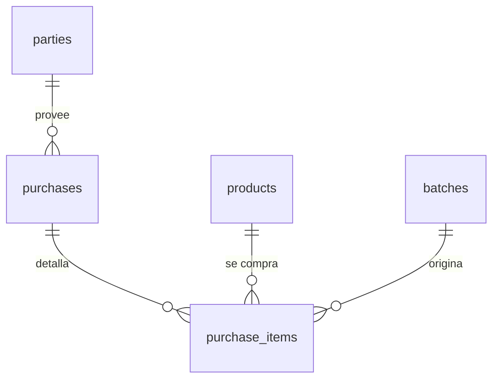

**Este módulo no existía en ninguno de los tres documentos.** Es un hueco importante: el
Avance del ERD declara explícitamente que el modelo debe soportar la "compra de café a
campesinos" y el flujo de negocio empieza en "compra/abastecimiento → lote →
inventario", pero no había ninguna entidad para registrarla. Sin `purchases`, el costo
de entrada del café verde no tiene origen documental y todo el costeo queda sin base.

### 6.1 `purchases`

| Columna | Tipo | Nulo | Restricción / Nota |
|---|---|---|---|
| `id` | BIGINT | NO | PK |
| `purchase_number` | VARCHAR(30) | NO | UNIQUE. Consecutivo interno |
| `party_id` | BIGINT | NO | FK → `parties.id`, ON DELETE RESTRICT. Proveedor o campesino |
| `purchase_type` | VARCHAR(25) | NO | CHECK IN (`COFFEE_GROWER`,`SUPPLIER`,`SERVICE`,`ASSET`) |
| `purchase_date` | DATE | NO | |
| `status` | VARCHAR(20) | NO | CHECK IN (`DRAFT`,`CONFIRMED`,`RECEIVED`,`CANCELLED`). DEFAULT `DRAFT` |
| `destination_location_id` | BIGINT | SÍ | FK → `inventory_locations.id`, ON DELETE RESTRICT |
| `currency` | CHAR(3) | NO | DEFAULT `'COP'` |
| `subtotal` | NUMERIC(16,2) | NO | DEFAULT 0 |
| `discount_total` | NUMERIC(16,2) | NO | DEFAULT 0 |
| `tax_total` | NUMERIC(16,2) | NO | DEFAULT 0 |
| `withholding_total` | NUMERIC(16,2) | NO | DEFAULT 0. Retención en la fuente al productor |
| `freight_amount` | NUMERIC(16,2) | NO | DEFAULT 0 |
| `total` | NUMERIC(16,2) | NO | DEFAULT 0 |
| `payment_status` | VARCHAR(20) | NO | CHECK IN (`UNPAID`,`PARTIAL`,`PAID`). DEFAULT `UNPAID` |
| `supplier_document_type` | VARCHAR(30) | SÍ | CHECK IN (`FACTURA`,`DOCUMENTO_SOPORTE`,`RECIBO`,`NINGUNO`) |
| `supplier_document_number` | VARCHAR(40) | SÍ | |
| `received_at` | TIMESTAMPTZ | SÍ | |
| `notes` | TEXT | SÍ | |
| Auditoría | | | Completa |

Índices: `ix_purchases_party_date`(`party_id`, `purchase_date`);
`ix_purchases_status`(`status`).

`supplier_document_type` con valor `DOCUMENTO_SOPORTE` cubre un caso real y frecuente:
cuando se le compra a un campesino no obligado a facturar, quien debe emitir el
documento electrónico es Densa Niebla, no el proveedor. Ese documento se genera desde el
módulo de facturación (sección 11), y esta columna es el vínculo conceptual.

`freight_amount` a nivel de cabecera se distribuye entre las líneas para el costeo; el
método de distribución (por valor o por peso) se configura en `app_settings`.

### 6.2 `purchase_items`

| Columna | Tipo | Nulo | Restricción / Nota |
|---|---|---|---|
| `id` | BIGINT | NO | PK |
| `purchase_id` | BIGINT | NO | FK → `purchases.id`, ON DELETE CASCADE |
| `line_no` | SMALLINT | NO | |
| `product_id` | BIGINT | NO | FK → `products.id`, ON DELETE RESTRICT |
| `batch_id` | BIGINT | SÍ | FK → `batches.id`, ON DELETE RESTRICT. El lote que se crea al recibir |
| `quantity` | NUMERIC(16,4) | NO | CHECK > 0 |
| `unit_id` | BIGINT | NO | FK → `units_of_measure.id` |
| `quantity_base` | NUMERIC(16,4) | NO | Convertida a la unidad base del producto |
| `unit_price` | NUMERIC(16,4) | NO | CHECK >= 0 |
| `discount_amount` | NUMERIC(16,2) | NO | DEFAULT 0 |
| `tax_id` | BIGINT | SÍ | FK → `taxes.id` |
| `tax_rate` | NUMERIC(9,6) | NO | DEFAULT 0. Snapshot |
| `tax_amount` | NUMERIC(16,2) | NO | DEFAULT 0 |
| `allocated_freight` | NUMERIC(16,2) | NO | DEFAULT 0. Flete distribuido a esta línea |
| `subtotal` | NUMERIC(16,2) | NO | |
| `total` | NUMERIC(16,2) | NO | |
| `landed_unit_cost` | NUMERIC(16,4) | NO | Costo unitario puesto en bodega, en unidad base |
| `notes` | TEXT | SÍ | |
| Auditoría | | | `created_at`, `updated_at` |

Restricciones: UNIQUE(`purchase_id`, `line_no`).

`landed_unit_cost` es el campo que alimenta el inventario. Se calcula como
`(subtotal - discount_amount + allocated_freight) / quantity_base`. Los impuestos
descontables no entran al costo; las retenciones tampoco. Ese cálculo vive en la capa de
servicios, no en la base.

---

## 7. Módulo Inventario y Lotes

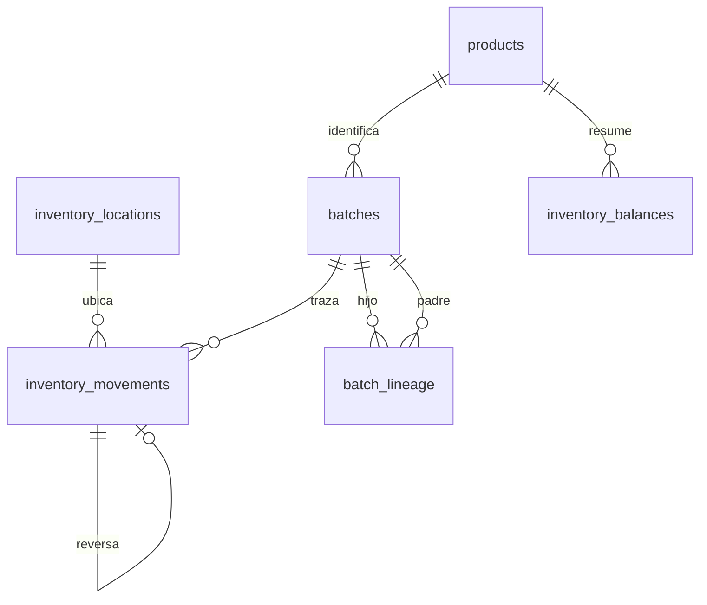

El principio del Avance del ERD es que el inventario es un libro histórico de
movimientos, no una cifra. Se respeta de forma estricta: `inventory_movements` es una
tabla **append-only**.

### 7.1 `inventory_locations`

| Columna | Tipo | Nulo | Restricción / Nota |
|---|---|---|---|
| `id` | BIGINT | NO | PK |
| `code` | VARCHAR(30) | NO | UNIQUE |
| `name` | VARCHAR(100) | NO | |
| `location_type` | VARCHAR(30) | NO | CHECK IN (`WAREHOUSE`,`PROCESSOR`,`IN_TRANSIT`,`CONSIGNMENT`,`CUSTOMER`,`SCRAP`,`VIRTUAL`) |
| `party_id` | BIGINT | SÍ | FK → `parties.id`, ON DELETE RESTRICT. Requerido para `PROCESSOR` y `CONSIGNMENT` |
| `address_id` | BIGINT | SÍ | FK → `addresses.id`, ON DELETE SET NULL |
| `allows_negative_stock` | BOOLEAN | NO | DEFAULT FALSE |
| `is_active` | BOOLEAN | NO | DEFAULT TRUE |
| `notes` | TEXT | SÍ | |
| Auditoría | | | Completa |

Restricción: CHECK `location_type NOT IN ('PROCESSOR','CONSIGNMENT') OR party_id IS NOT
NULL`.

**Esta tabla resuelve un problema que los documentos no habían abordado.** Cuando envías
250 libras de café verde al trillador, ese café sigue siendo tuyo y sigue siendo tu
inventario, pero no está en tu bodega. Modelar al maquilador como una ubicación de tipo
`PROCESSOR` permite:

- Saber en todo momento cuánto café tienes en poder de terceros y con quién
- Registrar la merma en el sitio donde ocurrió
- Cuadrar el inventario físico de tu bodega sin que el café en maquila lo descuadre
- Detectar si un maquilador devuelve menos de lo esperado

Sin esto, el café en maquila se vuelve invisible o se descuenta como si se hubiera
consumido, y el cruce con inventario físico —objetivo explícito del documento maestro—
nunca cuadra.

El tipo `SCRAP` es la contrapartida de la merma no recuperable: los movimientos de
salida por merma tienen que ir a algún lado para que el libro cuadre.

### 7.2 `batches`

| Columna | Tipo | Nulo | Restricción / Nota |
|---|---|---|---|
| `id` | BIGINT | NO | PK |
| `batch_code` | VARCHAR(40) | NO | UNIQUE. Legible: `VRD-2026-0031`, `TST-2026-0114` |
| `product_id` | BIGINT | NO | FK → `products.id`, ON DELETE RESTRICT |
| `batch_type` | VARCHAR(25) | NO | CHECK IN (`PURCHASED`,`PRODUCED`,`ADJUSTED`) |
| `origin_party_id` | BIGINT | SÍ | FK → `parties.id`, ON DELETE RESTRICT. El campesino productor |
| `origin_address_id` | BIGINT | SÍ | FK → `addresses.id`, ON DELETE SET NULL. La finca |
| `farm_name` | VARCHAR(150) | SÍ | Snapshot: la finca puede cambiar de nombre o dueño |
| `municipality_name` | VARCHAR(100) | SÍ | Snapshot de origen |
| `harvest_year` | SMALLINT | SÍ | Cosecha, dato de trazabilidad |
| `harvest_period` | VARCHAR(20) | SÍ | CHECK IN (`PRINCIPAL`,`TRAVIESA`) |
| `production_order_id` | BIGINT | SÍ | FK → `production_orders.id`, ON DELETE SET NULL. Si `batch_type='PRODUCED'` |
| `purchase_item_id` | BIGINT | SÍ | FK → `purchase_items.id`, ON DELETE SET NULL. Si `batch_type='PURCHASED'` |
| `initial_quantity` | NUMERIC(16,4) | NO | En unidad base del producto. CHECK > 0 |
| `unit_id` | BIGINT | NO | FK → `units_of_measure.id` |
| `unit_cost` | NUMERIC(16,4) | NO | Costo unitario del lote. Base del costeo `SPECIFIC_BATCH` |
| `currency` | CHAR(3) | NO | DEFAULT `'COP'` |
| `humidity_pct` | NUMERIC(5,2) | SÍ | Humedad al recibir. CHECK entre 0 y 100 |
| `defect_pct` | NUMERIC(5,2) | SÍ | Factor de rendimiento / merma esperada |
| `cupping_score` | NUMERIC(5,2) | SÍ | |
| `received_date` | DATE | SÍ | |
| `production_date` | DATE | SÍ | Fecha de tostión o empaque |
| `expiry_date` | DATE | SÍ | Vencimiento del producto terminado |
| `status` | VARCHAR(20) | NO | CHECK IN (`ACTIVE`,`DEPLETED`,`BLOCKED`,`EXPIRED`). DEFAULT `ACTIVE` |
| `quality_notes` | TEXT | SÍ | |
| Auditoría | | | Completa |

Restricciones:

- CHECK: `batch_type <> 'PRODUCED' OR production_order_id IS NOT NULL`
- CHECK: `expiry_date IS NULL OR production_date IS NULL OR expiry_date >= production_date`

Índices: `ix_batches_product`(`product_id`, `status`);
`ix_batches_origin_party`(`origin_party_id`); `ix_batches_harvest_year`.

`status = BLOCKED` es operativamente valioso: permite retener un lote con problema de
calidad para que no se pueda vender, sin borrarlo ni alterar el inventario.

El estado `DEPLETED` es un dato derivado (saldo cero) que se materializa por rendimiento.
Debe poder recalcularse desde los movimientos.

### 7.3 `batch_lineage`

| Columna | Tipo | Nulo | Restricción / Nota |
|---|---|---|---|
| `id` | BIGINT | NO | PK |
| `child_batch_id` | BIGINT | NO | FK → `batches.id`, ON DELETE CASCADE |
| `parent_batch_id` | BIGINT | NO | FK → `batches.id`, ON DELETE RESTRICT |
| `quantity_consumed` | NUMERIC(16,4) | NO | Cantidad del lote padre que entró al hijo. CHECK > 0 |
| `unit_id` | BIGINT | NO | FK → `units_of_measure.id` |
| `contribution_pct` | NUMERIC(9,6) | SÍ | Participación del padre en el hijo, para costeo |
| `production_order_id` | BIGINT | SÍ | FK → `production_orders.id`, ON DELETE SET NULL |
| Auditoría | | | `created_at`, `updated_at` |

Restricciones: UNIQUE(`child_batch_id`, `parent_batch_id`); CHECK `child_batch_id <>
parent_batch_id`.

Se usa una tabla de linaje en lugar de un `parent_batch_id` simple en `batches` porque
la relación es genuinamente N:N: una tostión puede mezclar tres lotes de café verde de
tres fincas distintas, y un lote de verde puede alimentar varias tostiones. Con una FK
simple, el primer blend rompe el modelo.

`contribution_pct` permite responder la pregunta de trazabilidad hacia atrás: "esta
bolsa que vendí, ¿de qué fincas viene y en qué proporción". Es el dato que sustenta
cualquier reclamo de origen.

### 7.4 `inventory_movements`

La tabla central del sistema. **Append-only: nunca se hace UPDATE ni DELETE.** Un error
se corrige con un movimiento de reversa que apunta al original.

| Columna | Tipo | Nulo | Restricción / Nota |
|---|---|---|---|
| `id` | BIGINT | NO | PK |
| `movement_type` | VARCHAR(35) | NO | Ver catálogo abajo |
| `direction` | SMALLINT | NO | CHECK IN (1, -1). 1 = entrada, -1 = salida |
| `product_id` | BIGINT | NO | FK → `products.id`, ON DELETE RESTRICT |
| `batch_id` | BIGINT | SÍ | FK → `batches.id`, ON DELETE RESTRICT. NULL solo si `products.tracks_batches=FALSE` |
| `location_id` | BIGINT | NO | FK → `inventory_locations.id`, ON DELETE RESTRICT |
| `quantity` | NUMERIC(16,4) | NO | **Siempre positiva**. CHECK > 0 |
| `unit_id` | BIGINT | NO | FK → `units_of_measure.id` |
| `quantity_base` | NUMERIC(16,4) | NO | Convertida a unidad base. CHECK > 0 |
| `unit_cost` | NUMERIC(16,4) | SÍ | Costo unitario del movimiento, en unidad base |
| `total_cost` | NUMERIC(16,2) | SÍ | |
| `currency` | CHAR(3) | NO | DEFAULT `'COP'` |
| `occurred_at` | TIMESTAMPTZ | NO | Cuándo pasó en la realidad, no cuándo se registró |
| `reference_type` | VARCHAR(30) | SÍ | CHECK IN (`PURCHASE_ITEM`,`SALE_ITEM_BATCH`,`PRODUCTION_INPUT`,`PRODUCTION_OUTPUT`,`PRODUCTION_WASTE`,`SHIPMENT_ITEM`,`ADJUSTMENT`,`TRANSFER`,`COUNT`) |
| `reference_id` | BIGINT | SÍ | Id del registro referenciado |
| `counterpart_movement_id` | BIGINT | SÍ | FK → `inventory_movements.id`. Par del traslado |
| `reverses_movement_id` | BIGINT | SÍ | FK → `inventory_movements.id`. Movimiento que corrige |
| `reason_code` | VARCHAR(30) | SÍ | Para ajustes: `CONTEO_FISICO`,`DANO`,`ROBO`,`ERROR_REGISTRO`,`MUESTRA`,`OBSEQUIO` |
| `notes` | TEXT | SÍ | |
| `created_at` | TIMESTAMPTZ | NO | DEFAULT now() |
| `created_by_id` | BIGINT | SÍ | FK → `users.id` |

Catálogo de `movement_type` y su `direction` obligatorio:

| `movement_type` | `direction` | Origen |
|---|---|---|
| `IN_PURCHASE` | +1 | Recepción de compra |
| `IN_PRODUCTION` | +1 | Salida de producción |
| `IN_SALE_RETURN` | +1 | Devolución de cliente |
| `IN_ADJUSTMENT` | +1 | Ajuste positivo por conteo |
| `IN_TRANSFER` | +1 | Llegada de traslado |
| `IN_WASTE_RECOVERY` | +1 | Subproducto recuperado (pasilla) |
| `OUT_SALE` | -1 | Despacho por venta |
| `OUT_PRODUCTION` | -1 | Consumo en producción |
| `OUT_WASTE` | -1 | Merma |
| `OUT_ADJUSTMENT` | -1 | Ajuste negativo por conteo |
| `OUT_TRANSFER` | -1 | Envío de traslado |
| `OUT_SAMPLE` | -1 | Muestra comercial o de catación |
| `OUT_PURCHASE_RETURN` | -1 | Devolución a proveedor |

Restricciones:

- CHECK que amarra cada `movement_type` a su `direction` correcto
- CHECK: `reference_type IS NULL OR reference_id IS NOT NULL`
- CHECK: `movement_type NOT LIKE '%TRANSFER%' OR counterpart_movement_id IS NOT NULL` (validado en servicio, ya que ambos se crean en la misma transacción)

Índices:

```
ix_inventory_movements_lookup  (product_id, batch_id, location_id, occurred_at)
ix_inventory_movements_occurred (occurred_at DESC)
ix_inventory_movements_reference (reference_type, reference_id)
ix_inventory_movements_type     (movement_type)
```

El primero es crítico: es el índice sobre el que se calcula cualquier saldo.

**Decisiones de diseño relevantes.** La `quantity` siempre positiva con `direction`
separado —en lugar de cantidades con signo— hace que las sumas sean explícitas
(`SUM(quantity_base * direction)`), evita el error de registrar una salida en positivo, y
permite reportes de "total movido" sin valores absolutos.

`occurred_at` separado de `created_at` importa porque los registros del negocio real se
hacen con retraso: una tostión del martes se puede registrar el jueves, y el reporte
mensual debe usar la fecha del hecho.

La referencia polimórfica (`reference_type` + `reference_id`) no lleva FK real. Es una
concesión consciente: las alternativas son doce columnas FK nulables o doce tablas
puente, y ninguna se justifica. La integridad se garantiza en la capa de servicios, que
es la única autorizada a crear movimientos.

### 7.5 `inventory_balances`

Tabla **derivada** de `inventory_movements`, mantenida por la capa de servicios.
Reconstruible en cualquier momento; nunca es la fuente de verdad.

| Columna | Tipo | Nulo | Restricción / Nota |
|---|---|---|---|
| `id` | BIGINT | NO | PK |
| `product_id` | BIGINT | NO | FK → `products.id`, ON DELETE CASCADE |
| `batch_id` | BIGINT | SÍ | FK → `batches.id`, ON DELETE CASCADE |
| `location_id` | BIGINT | NO | FK → `inventory_locations.id`, ON DELETE CASCADE |
| `quantity_base` | NUMERIC(16,4) | NO | DEFAULT 0. Saldo actual |
| `average_unit_cost` | NUMERIC(16,4) | NO | DEFAULT 0. Promedio ponderado móvil |
| `total_value` | NUMERIC(16,2) | NO | DEFAULT 0 |
| `last_movement_id` | BIGINT | SÍ | FK → `inventory_movements.id`, ON DELETE SET NULL |
| `last_movement_at` | TIMESTAMPTZ | SÍ | |
| `updated_at` | TIMESTAMPTZ | NO | DEFAULT now() |

Restricción: UNIQUE(`product_id`, `batch_id`, `location_id`), con índice único parcial
adicional para el caso `batch_id IS NULL`, porque en SQL `NULL` no es igual a `NULL` y
sin eso se crearían filas duplicadas para productos sin lote.

```sql
CREATE UNIQUE INDEX uq_inventory_balances_no_batch
ON inventory_balances (product_id, location_id) WHERE batch_id IS NULL;
```

Existe por rendimiento. Sumar cientos de miles de movimientos cada vez que se muestra el
stock de un producto no escala, y el dashboard del ERP consulta stock constantemente.
Debe existir un comando de mantenimiento `flask inventory rebuild-balances` que la
recalcule desde cero y compare, para detectar cualquier divergencia.

`average_unit_cost` es el soporte del costeo por promedio ponderado descrito en la
sección 9.
---

## 8. Módulo Producción

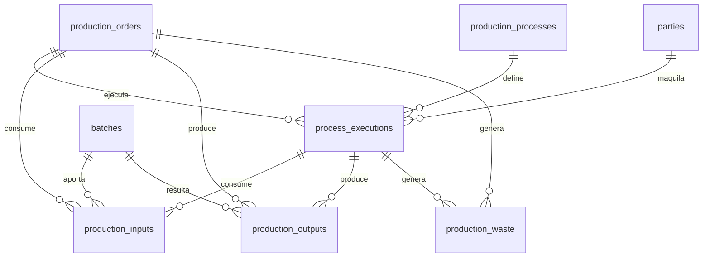

La regla central del ERD conceptual: el mismo proceso debe poder ejecutarse por maquila
externa hoy y con maquinaria propia mañana, sin rediseñar el modelo. Eso se logra
separando el **proceso** (qué se hace) de la **ejecución** (quién lo hizo, cuándo y a qué
costo).

### 8.1 `production_processes`

Catálogo de procesos. Cinco filas iniciales.

| Columna | Tipo | Nulo | Restricción / Nota |
|---|---|---|---|
| `id` | BIGINT | NO | PK |
| `code` | VARCHAR(30) | NO | UNIQUE. `TRILLA`, `TOSTION`, `MOLIENDA`, `EMPAQUE`, `ETIQUETA` |
| `name` | VARCHAR(100) | NO | |
| `description` | TEXT | SÍ | |
| `default_sequence` | SMALLINT | NO | Orden típico: 10, 20, 30, 40, 50 |
| `default_unit_id` | BIGINT | NO | FK → `units_of_measure.id`. Unidad de costeo por defecto |
| `yields_new_batch` | BOOLEAN | NO | DEFAULT FALSE. TRUE en trilla y tostión |
| `changes_product` | BOOLEAN | NO | DEFAULT FALSE. TRUE si la salida es un producto distinto |
| `expected_yield_pct` | NUMERIC(9,6) | SÍ | Rendimiento esperado, para alertar desviaciones |
| `is_active` | BOOLEAN | NO | DEFAULT TRUE |
| Auditoría | | | Completa |

Valores iniciales propuestos para `yields_new_batch` y `changes_product`:

| Proceso | `yields_new_batch` | `changes_product` | Razonamiento |
|---|---|---|---|
| `TRILLA` | TRUE | TRUE | Pergamino → verde (excelso). Cambia producto y rinde ~80% |
| `TOSTION` | TRUE | TRUE | Verde → tostado. Cambia producto y pierde ~15-18% de peso |
| `MOLIENDA` | TRUE | TRUE | Tostado grano → molido |
| `EMPAQUE` | TRUE | TRUE | Granel → producto con SKU de venta |
| `ETIQUETA` | FALSE | FALSE | No transforma masa ni identidad del lote |

Los porcentajes de rendimiento son órdenes de magnitud del sector y quedan como
`expected_yield_pct` **por confirmar con los datos reales de la operación**. Su función
es alertar, no calcular: el costo real siempre sale de las cantidades registradas.

`expected_yield_pct` es un aporte útil: si una tostión rinde 60% cuando debería rendir
83%, o hubo un error de registro o hay un problema con el maquilador. El sistema debe
avisar.

### 8.2 `production_orders`

| Columna | Tipo | Nulo | Restricción / Nota |
|---|---|---|---|
| `id` | BIGINT | NO | PK |
| `order_number` | VARCHAR(30) | NO | UNIQUE. `PROD-2026-0042` |
| `status` | VARCHAR(20) | NO | CHECK IN (`DRAFT`,`RELEASED`,`IN_PROGRESS`,`COMPLETED`,`CLOSED`,`CANCELLED`). DEFAULT `DRAFT` |
| `target_product_id` | BIGINT | SÍ | FK → `products.id`, ON DELETE RESTRICT. Producto que se busca obtener |
| `planned_quantity` | NUMERIC(16,4) | SÍ | CHECK > 0 |
| `unit_id` | BIGINT | SÍ | FK → `units_of_measure.id` |
| `planned_start_date` | DATE | SÍ | |
| `started_at` | TIMESTAMPTZ | SÍ | |
| `completed_at` | TIMESTAMPTZ | SÍ | |
| `total_input_cost` | NUMERIC(16,2) | NO | DEFAULT 0. Costo de materias primas consumidas |
| `total_process_cost` | NUMERIC(16,2) | NO | DEFAULT 0. Costo de maquila y procesos |
| `total_overhead_cost` | NUMERIC(16,2) | NO | DEFAULT 0. Costos indirectos imputados |
| `total_cost` | NUMERIC(16,2) | NO | DEFAULT 0. Suma de los tres anteriores |
| `output_quantity_base` | NUMERIC(16,4) | NO | DEFAULT 0. Producto terminado obtenido |
| `waste_quantity_base` | NUMERIC(16,4) | NO | DEFAULT 0. Merma total |
| `yield_pct` | NUMERIC(9,6) | SÍ | Calculado: salida / entrada |
| `unit_cost` | NUMERIC(16,4) | SÍ | `total_cost / output_quantity_base` |
| `currency` | CHAR(3) | NO | DEFAULT `'COP'` |
| `notes` | TEXT | SÍ | |
| Auditoría | | | Completa |

Índices: `ix_production_orders_status`(`status`);
`ix_production_orders_dates`(`started_at`, `completed_at`).

Los cinco campos de costo se materializan al cerrar la orden (`status = CLOSED`). Antes
de eso son provisionales. Se separan en tres componentes porque la pregunta gerencial
real no es "cuánto costó" sino "cuánto de lo que costó fue café, cuánto fue maquila y
cuánto fue estructura" — y esa descomposición es la que permite decidir si comprar una
tostadora.

El estado `CLOSED` es distinto de `COMPLETED` a propósito: `COMPLETED` significa que la
producción física terminó, `CLOSED` que el costeo quedó cerrado y no admite más
imputaciones. Entre uno y otro pueden pasar días, porque la factura del maquilador llega
después.

### 8.3 `process_executions`

El corazón del diseño flexible de maquila.

| Columna | Tipo | Nulo | Restricción / Nota |
|---|---|---|---|
| `id` | BIGINT | NO | PK |
| `production_order_id` | BIGINT | NO | FK → `production_orders.id`, ON DELETE CASCADE |
| `process_id` | BIGINT | NO | FK → `production_processes.id`, ON DELETE RESTRICT |
| `sequence_no` | SMALLINT | NO | Orden real de ejecución en esta orden |
| `executor_type` | VARCHAR(20) | NO | CHECK IN (`INTERNAL`,`EXTERNAL`) |
| `executor_party_id` | BIGINT | SÍ | FK → `parties.id`, ON DELETE RESTRICT. El maquilador |
| `location_id` | BIGINT | SÍ | FK → `inventory_locations.id`. Dónde se ejecuta |
| `status` | VARCHAR(20) | NO | CHECK IN (`PENDING`,`SENT`,`IN_PROGRESS`,`RECEIVED`,`DONE`,`CANCELLED`). DEFAULT `PENDING` |
| `sent_at` | TIMESTAMPTZ | SÍ | Cuándo se envió el café al maquilador |
| `started_at` | TIMESTAMPTZ | SÍ | |
| `finished_at` | TIMESTAMPTZ | SÍ | |
| `received_at` | TIMESTAMPTZ | SÍ | Cuándo volvió el café |
| `input_quantity_base` | NUMERIC(16,4) | NO | DEFAULT 0 |
| `output_quantity_base` | NUMERIC(16,4) | NO | DEFAULT 0 |
| `waste_quantity_base` | NUMERIC(16,4) | NO | DEFAULT 0 |
| `yield_pct` | NUMERIC(9,6) | SÍ | Calculado |
| `cost_rule_id` | BIGINT | SÍ | FK → `cost_rules.id`, ON DELETE SET NULL. Regla aplicada |
| `cost_unit_id` | BIGINT | SÍ | FK → `units_of_measure.id`. Snapshot de la unidad de costeo |
| `cost_rate` | NUMERIC(16,4) | SÍ | Snapshot de la tarifa |
| `cost_basis` | VARCHAR(30) | SÍ | Snapshot de la base de cálculo |
| `chargeable_quantity` | NUMERIC(16,4) | SÍ | Cantidad sobre la que se cobró |
| `computed_cost` | NUMERIC(16,2) | NO | DEFAULT 0. Costo calculado por la regla |
| `actual_cost` | NUMERIC(16,2) | SÍ | Costo real facturado, si difiere |
| `currency` | CHAR(3) | NO | DEFAULT `'COP'` |
| `supplier_document_number` | VARCHAR(40) | SÍ | Factura del maquilador |
| `notes` | TEXT | SÍ | |
| Auditoría | | | Completa |

Restricciones:

- UNIQUE(`production_order_id`, `sequence_no`)
- CHECK: `(executor_type = 'EXTERNAL' AND executor_party_id IS NOT NULL) OR (executor_type = 'INTERNAL' AND executor_party_id IS NULL)`
- CHECK: `output_quantity_base + waste_quantity_base <= input_quantity_base` (tolerancia en servicio, por incrementos de humedad)

Índices: `ix_process_executions_order`(`production_order_id`, `sequence_no`);
`ix_process_executions_executor`(`executor_party_id`, `status`);
`ix_process_executions_status`(`status`).

**Cómo esto cumple la regla de la maquila reversible.** Hoy una tostión se registra con
`executor_type='EXTERNAL'`, `executor_party_id` = el tostador, y `cost_rule_id`
apuntando a una regla de tarifa por libra terminada. El día que Densa Niebla compre una
tostadora, la misma tostión se registra con `executor_type='INTERNAL'`,
`executor_party_id` NULL, y una `cost_rule` de tipo interno que suma energía, mano de
obra y depreciación. **Ninguna tabla cambia, ninguna migración se necesita, y los
históricos siguen siendo comparables** — que era exactamente el requisito.

El par `computed_cost` / `actual_cost` cubre el caso real de que el maquilador facture
distinto a lo pactado. Se conservan ambos y la diferencia es visible, en lugar de
sobrescribir el cálculo y perder la evidencia.

`status='SENT'` combinado con la ubicación `PROCESSOR` de la sección 7.1 es lo que
permite saber que hay café afuera y con quién.

### 8.4 `production_inputs`

| Columna | Tipo | Nulo | Restricción / Nota |
|---|---|---|---|
| `id` | BIGINT | NO | PK |
| `production_order_id` | BIGINT | NO | FK → `production_orders.id`, ON DELETE CASCADE |
| `process_execution_id` | BIGINT | SÍ | FK → `process_executions.id`, ON DELETE SET NULL. NULL = consumo general de la orden |
| `product_id` | BIGINT | NO | FK → `products.id`, ON DELETE RESTRICT |
| `batch_id` | BIGINT | SÍ | FK → `batches.id`, ON DELETE RESTRICT |
| `quantity` | NUMERIC(16,4) | NO | CHECK > 0 |
| `unit_id` | BIGINT | NO | FK → `units_of_measure.id` |
| `quantity_base` | NUMERIC(16,4) | NO | |
| `unit_cost` | NUMERIC(16,4) | NO | Costo unitario al momento del consumo |
| `total_cost` | NUMERIC(16,2) | NO | |
| `currency` | CHAR(3) | NO | DEFAULT `'COP'` |
| `movement_id` | BIGINT | SÍ | FK → `inventory_movements.id`, ON DELETE SET NULL |
| `consumed_at` | TIMESTAMPTZ | NO | DEFAULT now() |
| `notes` | TEXT | SÍ | |
| Auditoría | | | `created_at`, `updated_at` |

El `process_execution_id` nulable distingue el café que entra a una tostión específica
(atribuible) de los insumos generales de la orden como bolsas y etiquetas.

`movement_id` es el enlace con el libro de inventario: todo consumo genera un movimiento
`OUT_PRODUCTION`, y esta FK garantiza que se pueda auditar en ambas direcciones.

### 8.5 `production_outputs`

| Columna | Tipo | Nulo | Restricción / Nota |
|---|---|---|---|
| `id` | BIGINT | NO | PK |
| `production_order_id` | BIGINT | NO | FK → `production_orders.id`, ON DELETE CASCADE |
| `process_execution_id` | BIGINT | SÍ | FK → `process_executions.id`, ON DELETE SET NULL |
| `product_id` | BIGINT | NO | FK → `products.id`, ON DELETE RESTRICT |
| `batch_id` | BIGINT | SÍ | FK → `batches.id`, ON DELETE RESTRICT. El lote nuevo generado |
| `quantity` | NUMERIC(16,4) | NO | CHECK > 0 |
| `unit_id` | BIGINT | NO | FK → `units_of_measure.id` |
| `quantity_base` | NUMERIC(16,4) | NO | |
| `output_kind` | VARCHAR(20) | NO | CHECK IN (`MAIN`,`BYPRODUCT`,`REWORK`). DEFAULT `MAIN` |
| `cost_allocation_pct` | NUMERIC(9,6) | SÍ | Porción del costo total asignada |
| `allocated_cost` | NUMERIC(16,2) | NO | DEFAULT 0 |
| `unit_cost` | NUMERIC(16,4) | SÍ | `allocated_cost / quantity_base` |
| `currency` | CHAR(3) | NO | DEFAULT `'COP'` |
| `location_id` | BIGINT | SÍ | FK → `inventory_locations.id`. Dónde queda |
| `movement_id` | BIGINT | SÍ | FK → `inventory_movements.id`, ON DELETE SET NULL |
| `produced_at` | TIMESTAMPTZ | NO | DEFAULT now() |
| `notes` | TEXT | SÍ | |
| Auditoría | | | `created_at`, `updated_at` |

`output_kind = BYPRODUCT` con `cost_allocation_pct` resuelve un caso concreto del café:
la trilla produce excelso (producto principal) y pasilla (subproducto vendible). Si todo
el costo se carga al excelso, su costo unitario queda inflado; si se reparte por valor de
mercado, el margen real de ambos se ve bien. El sistema permite las dos políticas, y la
elegida se configura en `app_settings`.

### 8.6 `production_waste`

| Columna | Tipo | Nulo | Restricción / Nota |
|---|---|---|---|
| `id` | BIGINT | NO | PK |
| `production_order_id` | BIGINT | NO | FK → `production_orders.id`, ON DELETE CASCADE |
| `process_execution_id` | BIGINT | SÍ | FK → `process_executions.id`, ON DELETE SET NULL |
| `product_id` | BIGINT | NO | FK → `products.id`, ON DELETE RESTRICT. Producto que se perdió |
| `batch_id` | BIGINT | SÍ | FK → `batches.id`, ON DELETE RESTRICT |
| `quantity` | NUMERIC(16,4) | NO | CHECK > 0 |
| `unit_id` | BIGINT | NO | FK → `units_of_measure.id` |
| `quantity_base` | NUMERIC(16,4) | NO | |
| `waste_type` | VARCHAR(30) | NO | CHECK IN (`MERMA_HUMEDAD`,`MERMA_PROCESO`,`PASILLA`,`CASCARILLA`,`DEFECTO`,`DERRAME`,`CONTAMINACION`) |
| `is_expected` | BOOLEAN | NO | DEFAULT TRUE. Merma normal vs. anómala |
| `is_recoverable` | BOOLEAN | NO | DEFAULT FALSE |
| `recovered_product_id` | BIGINT | SÍ | FK → `products.id`. Si la merma es vendible |
| `recovered_batch_id` | BIGINT | SÍ | FK → `batches.id` |
| `cost_treatment` | VARCHAR(30) | NO | CHECK IN (`ABSORBED_BY_OUTPUT`,`EXPENSED`,`ALLOCATED_TO_BYPRODUCT`). DEFAULT `ABSORBED_BY_OUTPUT` |
| `cost_amount` | NUMERIC(16,2) | NO | DEFAULT 0 |
| `movement_id` | BIGINT | SÍ | FK → `inventory_movements.id`, ON DELETE SET NULL |
| `occurred_at` | TIMESTAMPTZ | NO | DEFAULT now() |
| `notes` | TEXT | SÍ | |
| Auditoría | | | `created_at`, `updated_at` |

Restricción: CHECK `is_recoverable = FALSE OR recovered_product_id IS NOT NULL`.

Este diseño responde a la pregunta abierta del Avance del ERD: *"¿qué debe considerarse
merma y cómo afecta inventario y costo?"*. La respuesta que propone el modelo tiene tres
niveles.

**Qué tipo de merma es.** La cascarilla de la trilla y la pérdida de humedad en la
tostión son mermas inherentes al proceso. La pasilla es café de menor calidad que sale
del proceso y tiene mercado. Un derrame es un evento anómalo. Meterlas todas en un solo
campo "merma" impide analizarlas, y son problemas distintos.

**Si es recuperable.** La cascarilla puede venderse como abono y la pasilla como café de
segunda. Con `is_recoverable = TRUE` y `recovered_product_id`, el sistema genera un
movimiento `IN_WASTE_RECOVERY` y la merma deja de ser pérdida pura.

**Cómo trata el costo.** `ABSORBED_BY_OUTPUT` reparte el costo de la merma entre el
producto bueno, que es el tratamiento correcto para merma esperada, y sube el costo
unitario del producto terminado. `EXPENSED` lo manda a gasto del período, que es lo
correcto para merma anómala: si se derramaron 20 libras, ese costo no debe encarecer el
café que sí salió bien, porque distorsionaría el precio de venta.

El par `is_expected` / `cost_treatment` es lo que permite que el costo del producto sea
comparable entre lotes y a la vez que las pérdidas anómalas queden visibles.

---

## 9. Módulo Costos

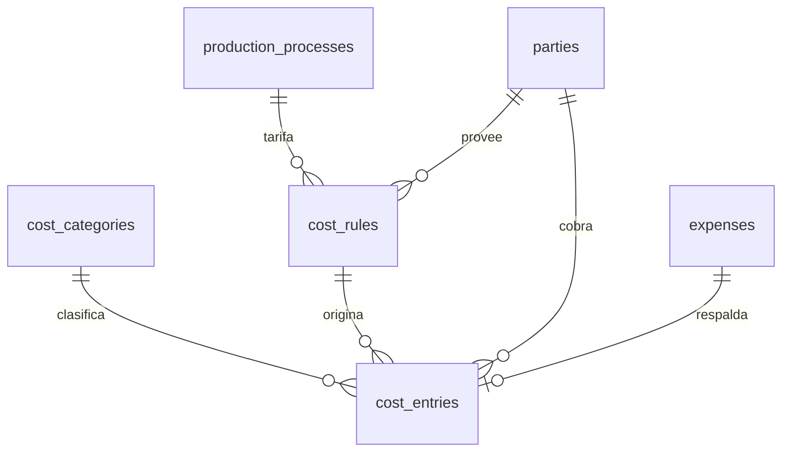

### 9.1 `cost_categories`

| Columna | Tipo | Nulo | Restricción / Nota |
|---|---|---|---|
| `id` | BIGINT | NO | PK |
| `code` | VARCHAR(30) | NO | UNIQUE |
| `name` | VARCHAR(100) | NO | |
| `parent_id` | BIGINT | SÍ | FK → `cost_categories.id`, ON DELETE RESTRICT |
| `nature` | VARCHAR(20) | NO | CHECK IN (`DIRECT`,`INDIRECT`) |
| `affects_inventory` | BOOLEAN | NO | DEFAULT TRUE. FALSE = va a gasto del período |
| `allocation_basis` | VARCHAR(25) | SÍ | CHECK IN (`QUANTITY`,`VALUE`,`TIME`,`MANUAL`). Cómo se reparte si es indirecto |
| `is_active` | BOOLEAN | NO | DEFAULT TRUE |
| Auditoría | | | Completa |

Categorías iniciales sugeridas: `MATERIA_PRIMA`, `MAQUILA_TRILLA`, `MAQUILA_TOSTION`,
`MAQUILA_MOLIENDA`, `MAQUILA_EMPAQUE`, `MAQUILA_ETIQUETA`, `EMPAQUE_INSUMOS`,
`FLETE_ENTRADA`, `FLETE_SALIDA`, `MANO_OBRA_DIRECTA`, `ENERGIA`, `DEPRECIACION`,
`MANTENIMIENTO`, `COMISION_INTERMEDIARIO`.

`affects_inventory` es la columna que decide si un costo entra al valor del inventario o
se lleva directo al resultado del período. Es la distinción que hace que el margen sea
creíble: el flete de entrada del café es costo del inventario, el flete de salida al
cliente es gasto de venta. Confundirlos infla el activo.

Esto responde la pregunta abierta *"¿qué costos son directos por orden/proceso y cuáles
son indirectos?"*: la clasificación no se hardcodea, se configura por categoría, y el
área contable puede ajustarla sin tocar código.

### 9.2 `cost_rules`

Recoge lo que el ERD conceptual llamaba `PROCESS COST RULE`, generalizado para cubrir
cualquier objeto costeable.

| Columna | Tipo | Nulo | Restricción / Nota |
|---|---|---|---|
| `id` | BIGINT | NO | PK |
| `code` | VARCHAR(40) | NO | UNIQUE |
| `name` | VARCHAR(150) | NO | |
| `cost_category_id` | BIGINT | NO | FK → `cost_categories.id`, ON DELETE RESTRICT |
| `applies_to` | VARCHAR(30) | NO | CHECK IN (`PROCESS`,`PRODUCT`,`ORDER`,`SHIPMENT`,`SALE`) |
| `process_id` | BIGINT | SÍ | FK → `production_processes.id`, ON DELETE CASCADE |
| `product_id` | BIGINT | SÍ | FK → `products.id`, ON DELETE CASCADE. NULL = todos |
| `executor_type` | VARCHAR(20) | SÍ | CHECK IN (`INTERNAL`,`EXTERNAL`). NULL = ambos |
| `executor_party_id` | BIGINT | SÍ | FK → `parties.id`, ON DELETE RESTRICT. El maquilador específico |
| `calculation_basis` | VARCHAR(30) | NO | CHECK IN (`PER_UNIT_OUTPUT`,`PER_UNIT_INPUT`,`FLAT`,`PER_HOUR`,`PCT_OF_INPUT_COST`) |
| `unit_id` | BIGINT | SÍ | FK → `units_of_measure.id`. Requerido salvo `FLAT` y `PCT_OF_INPUT_COST` |
| `rate` | NUMERIC(16,4) | NO | La tarifa. CHECK >= 0 |
| `currency` | CHAR(3) | NO | DEFAULT `'COP'` |
| `min_charge` | NUMERIC(16,2) | SÍ | Cargo mínimo del maquilador |
| `max_charge` | NUMERIC(16,2) | SÍ | |
| `min_quantity` | NUMERIC(16,4) | SÍ | Cantidad mínima para que aplique |
| `priority` | SMALLINT | NO | DEFAULT 100. Menor gana |
| `valid_from` | DATE | NO | |
| `valid_to` | DATE | SÍ | |
| `is_active` | BOOLEAN | NO | DEFAULT TRUE |
| `notes` | TEXT | SÍ | |
| Auditoría | | | Completa |

Restricciones:

- CHECK: `applies_to <> 'PROCESS' OR process_id IS NOT NULL`
- CHECK: `calculation_basis IN ('FLAT','PCT_OF_INPUT_COST') OR unit_id IS NOT NULL`
- CHECK: `executor_type <> 'EXTERNAL' OR executor_party_id IS NOT NULL OR TRUE` (regla genérica permitida)
- CHECK de vigencia
- CHECK: `max_charge IS NULL OR min_charge IS NULL OR max_charge >= min_charge`
- EXCLUDE de solapamiento sobre (`process_id`, `product_id`, `executor_party_id`, rango de fechas), según la sección 0.5

Índices: `ix_cost_rules_lookup`(`applies_to`, `process_id`, `valid_from`, `valid_to`);
`ix_cost_rules_executor`(`executor_party_id`).

`min_charge` no es un adorno: los maquiladores suelen cobrar un mínimo por tanda
independiente del volumen, y sin esa columna el costo calculado de las producciones
pequeñas queda por debajo del real.

`PER_UNIT_OUTPUT` es la base que corresponde a la situación actual descrita en el ERD
conceptual —tarifa por libra terminada—, y `PER_UNIT_INPUT` existe porque algunos
maquiladores cobran por lo que entra, no por lo que sale. La diferencia es material
cuando el rendimiento es del 80%.

#### Resolución de la regla de costo aplicable

```
Dada una ejecución de proceso, en una fecha:
1. Filtrar cost_rules por applies_to='PROCESS' y process_id
2. Filtrar por vigencia: valid_from <= fecha AND (valid_to IS NULL OR valid_to >= fecha)
3. Filtrar por is_active
4. Preferir la regla con executor_party_id igual al ejecutor real
5. Si no hay, preferir la que coincida en executor_type
6. Si no hay, tomar la genérica del proceso
7. Entre candidatas, la de menor priority
8. Si no hay ninguna -> ERROR explicito, no costo cero
```

El paso 8 es importante: un costo cero silencioso es peor que un error, porque produce
márgenes falsamente buenos que nadie cuestiona.

### 9.3 `cost_entries`

Los hechos económicos. Una fila por costo imputado a un objeto del negocio.

| Columna | Tipo | Nulo | Restricción / Nota |
|---|---|---|---|
| `id` | BIGINT | NO | PK |
| `cost_category_id` | BIGINT | NO | FK → `cost_categories.id`, ON DELETE RESTRICT |
| `cost_rule_id` | BIGINT | SÍ | FK → `cost_rules.id`, ON DELETE SET NULL |
| `cost_object_type` | VARCHAR(30) | NO | CHECK IN (`PRODUCTION_ORDER`,`PROCESS_EXECUTION`,`BATCH`,`PRODUCT`,`SALE`,`SALE_ITEM`,`SHIPMENT`,`PURCHASE`,`PARTY`,`PERIOD`) |
| `cost_object_id` | BIGINT | SÍ | Id del objeto. NULL solo si `cost_object_type='PERIOD'` |
| `amount` | NUMERIC(16,2) | NO | CHECK <> 0. Puede ser negativo para correcciones |
| `currency` | CHAR(3) | NO | DEFAULT `'COP'` |
| `quantity` | NUMERIC(16,4) | SÍ | Cantidad base del cálculo |
| `unit_id` | BIGINT | SÍ | FK → `units_of_measure.id` |
| `unit_rate` | NUMERIC(16,4) | SÍ | Snapshot de la tarifa aplicada |
| `calculation_basis` | VARCHAR(30) | SÍ | Snapshot |
| `party_id` | BIGINT | SÍ | FK → `parties.id`, ON DELETE RESTRICT. A quién se le paga |
| `incurred_at` | TIMESTAMPTZ | NO | Fecha del hecho económico |
| `accounting_date` | DATE | NO | Fecha de imputación contable |
| `is_estimated` | BOOLEAN | NO | DEFAULT FALSE. TRUE mientras no llega el documento real |
| `expense_id` | BIGINT | SÍ | FK → `expenses.id`, ON DELETE SET NULL |
| `reverses_entry_id` | BIGINT | SÍ | FK → `cost_entries.id`. Para correcciones |
| `document_reference` | VARCHAR(60) | SÍ | Número de factura del proveedor |
| `notes` | TEXT | SÍ | |
| Auditoría | | | Completa |

Índices:

```
ix_cost_entries_object     (cost_object_type, cost_object_id)
ix_cost_entries_category   (cost_category_id, accounting_date)
ix_cost_entries_party      (party_id)
ix_cost_entries_accounting (accounting_date)
```

Al igual que en `inventory_movements`, la referencia polimórfica no lleva FK. Es la
alternativa razonable a diez columnas nulables, y responde directamente al requisito del
ERD conceptual: *"los costos deben poder imputarse a diferentes objetos del negocio"*.

`is_estimated` cubre el desfase real entre la operación y la contabilidad: la tostión se
hace hoy y se costea con la tarifa vigente, pero la factura del maquilador llega en dos
semanas. El costo estimado permite cerrar la orden y ver márgenes, y cuando llega el
documento real se registra el ajuste. Sin este campo, o se espera la factura para saber
cuánto costó, o el estimado se confunde con un dato firme.

`accounting_date` separada de `incurred_at` permite imputar al período correcto un costo
que se registra tarde.

### 9.4 Los dos métodos de costeo

Tu decisión fue soportar ambos de forma configurable. Así queda especificado.

**Selección del método.** Para un producto dado se resuelve así:

```
1. products.costing_method, si es distinto de SYSTEM_DEFAULT
2. app_settings['default_costing_method']
```

Es decir: política global con excepciones por producto. El caso de uso natural es tener
el sistema en `WEIGHTED_AVERAGE` y marcar los cafés de origen único y microlotes como
`SPECIFIC_BATCH`.

#### Método A — `SPECIFIC_BATCH` (costo por lote específico)

El costo de salida es el `unit_cost` del lote del que efectivamente sale la mercancía.

- **Requiere** `products.tracks_batches = TRUE`
- Al vender, `sale_item_batches` define de qué lotes sale y en qué cantidad; el costo de la línea es la suma ponderada de los costos de esos lotes
- Al producir, `batch_lineage.contribution_pct` reparte el costo de los lotes padre en el lote hijo
- El `unit_cost` de un lote se fija al crearlo y solo cambia si se le imputan costos posteriores (`cost_entries` con `cost_object_type='BATCH'`), en cuyo caso se recalcula

Ventaja: precisión total y trazabilidad de margen por finca. Es lo que permite responder
"¿cuánto gané con el café de don Aníbal?". Costo: exige rigor absoluto en el registro de
lotes.

#### Método B — `WEIGHTED_AVERAGE` (promedio ponderado móvil)

El costo de salida es el `average_unit_cost` vigente en `inventory_balances` al momento
del movimiento.

Recálculo en cada entrada:

```
nuevo_promedio = (saldo_valor + valor_entrada) / (saldo_cantidad + cantidad_entrada)
```

En cada salida el promedio **no cambia**; solo baja el saldo. Las salidas se valoran al
promedio vigente.

- El promedio se mantiene por combinación (`product_id`, `location_id`) — **no** por lote, porque promediar por lote no tiene sentido
- Las entradas por producción usan el costo total de la orden de producción
- Los ajustes negativos por conteo se valoran al promedio vigente

Ventaja: simplicidad operativa, tolerancia a registro imperfecto y es el tratamiento más
común en la práctica contable colombiana. Costo: se pierde la trazabilidad de margen por
origen.

#### Implicaciones de diseño de soportar ambos

1. `inventory_balances.average_unit_cost` y `batches.unit_cost` deben mantenerse **siempre**, ambos, con independencia del método activo. Así se puede cambiar de método sin quedarse sin datos históricos.
2. `inventory_movements.unit_cost` guarda el costo **efectivamente aplicado** en ese movimiento, según el método vigente en ese momento. Es el snapshot que hace auditable cualquier cambio de política.
3. Debe existir una columna en `app_settings` con la fecha del último cambio de método, porque un cambio de política de costeo tiene efecto contable y hay que poder explicar el quiebre en la serie.
4. La lógica vive en un único módulo `app/services/costing.py`, con una función de entrada `resolve_outbound_cost(product, batch, location, quantity, at)`. Ningún otro punto del código debe calcular costo de salida.

El punto 4 es el que hace sostenible la decisión: soportar dos métodos es razonable si la
bifurcación está en un solo lugar, y es una fuente inagotable de inconsistencias si está
repartida entre ventas, producción e inventario.
---

## 10. Módulo Ventas y Pagos

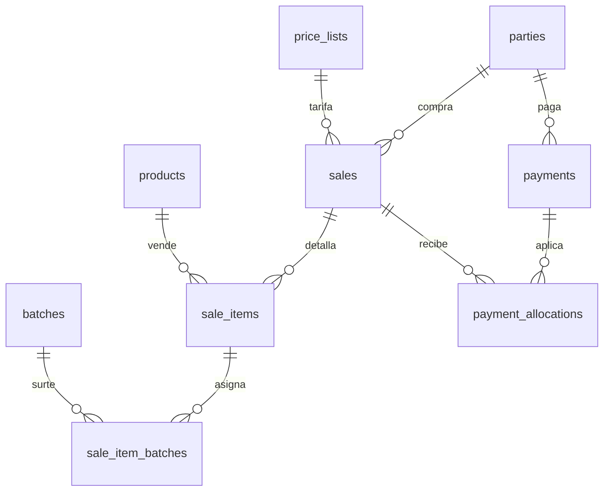

### 10.1 `sales`

| Columna | Tipo | Nulo | Restricción / Nota |
|---|---|---|---|
| `id` | BIGINT | NO | PK |
| `sale_number` | VARCHAR(30) | NO | UNIQUE. Consecutivo interno, distinto del número de factura |
| `party_id` | BIGINT | NO | FK → `parties.id`, ON DELETE RESTRICT |
| `channel` | VARCHAR(25) | NO | CHECK IN (`RETAIL`,`CAFETERIA`,`WHOLESALE`,`INTERMEDIARY`,`ONLINE`,`EVENT`) |
| `intermediary_party_id` | BIGINT | SÍ | FK → `parties.id`, ON DELETE RESTRICT |
| `price_list_id` | BIGINT | SÍ | FK → `price_lists.id`, ON DELETE RESTRICT. Snapshot de la lista usada |
| `salesperson_user_id` | BIGINT | SÍ | FK → `users.id`, ON DELETE SET NULL |
| `sale_date` | DATE | NO | |
| `status` | VARCHAR(20) | NO | CHECK IN (`DRAFT`,`CONFIRMED`,`DISPATCHED`,`DELIVERED`,`CANCELLED`,`RETURNED`). DEFAULT `DRAFT` |
| `payment_status` | VARCHAR(20) | NO | CHECK IN (`UNPAID`,`PARTIAL`,`PAID`,`OVERDUE`). DEFAULT `UNPAID` |
| `payment_term_days` | SMALLINT | NO | DEFAULT 0. Snapshot de las condiciones del cliente |
| `due_date` | DATE | SÍ | Calculada: `sale_date + payment_term_days` |
| `currency` | CHAR(3) | NO | DEFAULT `'COP'` |
| `subtotal` | NUMERIC(16,2) | NO | DEFAULT 0. Antes de descuentos e impuestos |
| `discount_total` | NUMERIC(16,2) | NO | DEFAULT 0 |
| `tax_total` | NUMERIC(16,2) | NO | DEFAULT 0 |
| `total` | NUMERIC(16,2) | NO | DEFAULT 0 |
| `paid_amount` | NUMERIC(16,2) | NO | DEFAULT 0 |
| `cost_total` | NUMERIC(16,2) | NO | DEFAULT 0. Snapshot del costo de la mercancía vendida |
| `margin_amount` | NUMERIC(16,2) | NO | DEFAULT 0. `total - tax_total - cost_total` |
| `margin_pct` | NUMERIC(9,6) | SÍ | |
| `freight_amount` | NUMERIC(16,2) | NO | DEFAULT 0. Flete cobrado al cliente |
| `shipping_address_id` | BIGINT | SÍ | FK → `addresses.id`, ON DELETE SET NULL |
| `confirmed_at` | TIMESTAMPTZ | SÍ | Momento en que se descontó inventario |
| `cancelled_at` | TIMESTAMPTZ | SÍ | |
| `cancellation_reason` | TEXT | SÍ | |
| `notes` | TEXT | SÍ | |
| Auditoría | | | Completa |

Restricciones:

- CHECK: `intermediary_party_id IS NULL OR intermediary_party_id <> party_id`
- CHECK: `total >= 0`
- CHECK: `status <> 'CANCELLED' OR cancelled_at IS NOT NULL`

Índices: `ix_sales_party_date`(`party_id`, `sale_date` DESC);
`ix_sales_status`(`status`); `ix_sales_date`(`sale_date` DESC);
`ix_sales_payment_status`(`payment_status`, `due_date`);
`ix_sales_channel`(`channel`, `sale_date`).

**`sale_number` es distinto del número de factura, a propósito.** Responde la pregunta
abierta del Avance: *"¿qué documento representa legalmente una venta antes y después de
la factura electrónica?"*. La respuesta que implementa el modelo es que la venta es el
hecho comercial y la factura es el documento fiscal que lo representa. Son entidades
separadas porque no siempre hay correspondencia uno a uno: una venta puede no llegar a
facturarse, una factura puede consolidar varias ventas, una nota crédito revierte
parcialmente una factura sin borrar la venta. Amarrar el consecutivo fiscal a la tabla
de ventas obligaría a emitir factura para poder registrar una venta, que es
operativamente inviable.

`cost_total` y `margin_amount` se materializan al confirmar la venta. Son snapshots
deliberados: el margen de una venta de marzo debe seguir siendo el que era, aunque el
costo del inventario haya cambiado. Es exactamente el mismo principio que aplica a los
precios.

El `payment_status` se mantiene por la capa de servicios a partir de
`payment_allocations`. No se calcula al vuelo porque el dashboard consulta cartera
constantemente.

### 10.2 `sale_items`

| Columna | Tipo | Nulo | Restricción / Nota |
|---|---|---|---|
| `id` | BIGINT | NO | PK |
| `sale_id` | BIGINT | NO | FK → `sales.id`, ON DELETE CASCADE |
| `line_no` | SMALLINT | NO | |
| `product_id` | BIGINT | NO | FK → `products.id`, ON DELETE RESTRICT |
| `description` | VARCHAR(255) | SÍ | Snapshot del nombre del producto al momento de la venta |
| `quantity` | NUMERIC(16,4) | NO | CHECK > 0 |
| `unit_id` | BIGINT | NO | FK → `units_of_measure.id`, ON DELETE RESTRICT |
| `quantity_base` | NUMERIC(16,4) | NO | Convertida a unidad base |
| `unit_price` | NUMERIC(16,4) | NO | CHECK >= 0. **Snapshot** |
| `price_list_item_id` | BIGINT | SÍ | FK → `price_list_items.id`, ON DELETE SET NULL. Trazabilidad del origen del precio |
| `price_source` | VARCHAR(30) | NO | CHECK IN (`PRICE_LIST`,`PARTY_RULE`,`MANUAL`). Auditoría de cómo se fijó |
| `discount_pct` | NUMERIC(9,6) | NO | DEFAULT 0. CHECK entre 0 y 1 |
| `discount_amount` | NUMERIC(16,2) | NO | DEFAULT 0 |
| `tax_id` | BIGINT | SÍ | FK → `taxes.id`, ON DELETE RESTRICT |
| `tax_rate` | NUMERIC(9,6) | NO | DEFAULT 0. **Snapshot de la tarifa** |
| `tax_amount` | NUMERIC(16,2) | NO | DEFAULT 0 |
| `subtotal` | NUMERIC(16,2) | NO | `quantity * unit_price - discount_amount` |
| `total` | NUMERIC(16,2) | NO | `subtotal + tax_amount` |
| `unit_cost` | NUMERIC(16,4) | NO | DEFAULT 0. Costo unitario aplicado, según método vigente |
| `total_cost` | NUMERIC(16,2) | NO | DEFAULT 0 |
| `margin_amount` | NUMERIC(16,2) | NO | DEFAULT 0 |
| `costing_method_used` | VARCHAR(25) | SÍ | Snapshot del método aplicado |
| `notes` | TEXT | SÍ | |
| Auditoría | | | `created_at`, `updated_at` |

Restricciones: UNIQUE(`sale_id`, `line_no`); CHECK `discount_pct >= 0 AND discount_pct <= 1`.

Índices: `ix_sale_items_sale`(`sale_id`); `ix_sale_items_product`(`product_id`).

Los seis campos de snapshot —`description`, `unit_price`, `price_list_item_id`,
`tax_rate`, `unit_cost`, `costing_method_used`— son la implementación literal del
principio del Avance del ERD: *"las ventas deben conservar históricos de precio y valores
aplicados"*. `costing_method_used` es un añadido derivado de tu decisión de costeo dual:
si el sistema cambia de política, hay que poder saber con qué método se costeó cada línea.

`price_source = MANUAL` permite auditar las ventas donde alguien sobreescribió el precio
sugerido, que es exactamente el dato que se necesita para saber si las reglas de precio
están funcionando o si se están ignorando en la práctica.

### 10.3 `sale_item_batches`

Tabla decidida en esta iteración. Implementa la trazabilidad por lote a nivel de línea de
venta.

| Columna | Tipo | Nulo | Restricción / Nota |
|---|---|---|---|
| `id` | BIGINT | NO | PK |
| `sale_item_id` | BIGINT | NO | FK → `sale_items.id`, ON DELETE CASCADE |
| `batch_id` | BIGINT | NO | FK → `batches.id`, ON DELETE RESTRICT |
| `location_id` | BIGINT | NO | FK → `inventory_locations.id`, ON DELETE RESTRICT. De qué ubicación salió |
| `quantity` | NUMERIC(16,4) | NO | CHECK > 0 |
| `unit_id` | BIGINT | NO | FK → `units_of_measure.id` |
| `quantity_base` | NUMERIC(16,4) | NO | CHECK > 0 |
| `unit_cost` | NUMERIC(16,4) | NO | Costo del lote aplicado a esta porción |
| `total_cost` | NUMERIC(16,2) | NO | |
| `movement_id` | BIGINT | SÍ | FK → `inventory_movements.id`, ON DELETE SET NULL |
| Auditoría | | | `created_at`, `updated_at` |

Restricciones: UNIQUE(`sale_item_id`, `batch_id`, `location_id`).

Índices: `ix_sib_batch`(`batch_id`); `ix_sib_sale_item`(`sale_item_id`).

**Invariante que debe validar la capa de servicios:**

```
SUM(sale_item_batches.quantity_base) == sale_items.quantity_base
```

No se implementa como CHECK porque una restricción de tabla no puede agregar filas de
otra tabla. Las opciones serían un trigger o validación en servicio; se elige el servicio
por consistencia con el resto del diseño, más una tarea de verificación periódica que
detecte líneas descuadradas.

**Por qué se incluye desde el inicio.** Tres razones. La primera es que la operación real
lo exige: cuando despachas 30 libras y el lote abierto tiene 18, la línea sale de dos
lotes, y con una FK simple habría que partir artificialmente la línea de venta o mentir
sobre el origen. La segunda es el costo de agregarla después: obligaría a migrar todas las
líneas de venta históricas inventando una asignación de lotes que nadie registró, o a
dejar un hueco permanente en la trazabilidad. La tercera es que sin esta tabla el costeo
`SPECIFIC_BATCH` no es implementable, y ese era el otro requisito.

Con esta tabla, la trazabilidad queda completa en ambos sentidos: hacia adelante
(*"¿a quién le vendí café de la finca de don Aníbal?"* → `batches` → `sale_item_batches`
→ `sales` → `parties`) y hacia atrás (*"esta bolsa que llegó con problema, ¿de dónde
venía?"* → `sale_item_batches` → `batches` → `batch_lineage` → lotes de origen).

### 10.4 `payments`

| Columna | Tipo | Nulo | Restricción / Nota |
|---|---|---|---|
| `id` | BIGINT | NO | PK |
| `payment_number` | VARCHAR(30) | NO | UNIQUE |
| `party_id` | BIGINT | NO | FK → `parties.id`, ON DELETE RESTRICT |
| `direction` | VARCHAR(15) | NO | CHECK IN (`INBOUND`,`OUTBOUND`). Cobro o pago |
| `payment_date` | DATE | NO | |
| `method` | VARCHAR(25) | NO | CHECK IN (`EFECTIVO`,`TRANSFERENCIA`,`NEQUI`,`DAVIPLATA`,`TARJETA`,`PSE`,`CHEQUE`,`CREDITO`,`OTRO`) |
| `amount` | NUMERIC(16,2) | NO | CHECK > 0 |
| `currency` | CHAR(3) | NO | DEFAULT `'COP'` |
| `allocated_amount` | NUMERIC(16,2) | NO | DEFAULT 0. Suma de `payment_allocations` |
| `unallocated_amount` | NUMERIC(16,2) | NO | DEFAULT 0. Anticipo sin aplicar |
| `status` | VARCHAR(20) | NO | CHECK IN (`PENDING`,`CONFIRMED`,`REVERSED`). DEFAULT `CONFIRMED` |
| `reference` | VARCHAR(80) | SÍ | Número de transacción o comprobante |
| `bank_account` | VARCHAR(60) | SÍ | |
| `receipt_path` | VARCHAR(255) | SÍ | Soporte escaneado |
| `notes` | TEXT | SÍ | |
| Auditoría | | | Completa |

Índices: `ix_payments_party`(`party_id`, `payment_date` DESC);
`ix_payments_status`(`status`).

Los métodos `NEQUI` y `DAVIPLATA` están explícitos porque son canales reales y
mayoritarios en la venta directa en Colombia, y agruparlos en "OTRO" impediría conciliar.

`direction = OUTBOUND` permite usar la misma tabla para los pagos a proveedores,
campesinos, maquiladores e intermediarios, en lugar de duplicar la estructura.

### 10.5 `payment_allocations`

| Columna | Tipo | Nulo | Restricción / Nota |
|---|---|---|---|
| `id` | BIGINT | NO | PK |
| `payment_id` | BIGINT | NO | FK → `payments.id`, ON DELETE CASCADE |
| `target_type` | VARCHAR(20) | NO | CHECK IN (`SALE`,`PURCHASE`,`INVOICE`,`FEE`,`EXPENSE`) |
| `target_id` | BIGINT | NO | Id del documento al que se aplica |
| `amount` | NUMERIC(16,2) | NO | CHECK > 0 |
| `allocated_at` | TIMESTAMPTZ | NO | DEFAULT now() |
| `notes` | TEXT | SÍ | |
| Auditoría | | | `created_at`, `updated_at` |

Restricción: UNIQUE(`payment_id`, `target_type`, `target_id`).

Índice: `ix_payment_allocations_target`(`target_type`, `target_id`).

La tabla intermedia existe porque la relación pago–venta es N:N en la práctica: una
cafetería paga tres facturas con una sola transferencia, y una venta grande se paga en
tres abonos. Un `sale_id` directo en `payments` no soporta ninguno de los dos casos.

Invariante de servicio: `SUM(payment_allocations.amount) <= payments.amount`.

---

## 11. Módulo Facturación DIAN

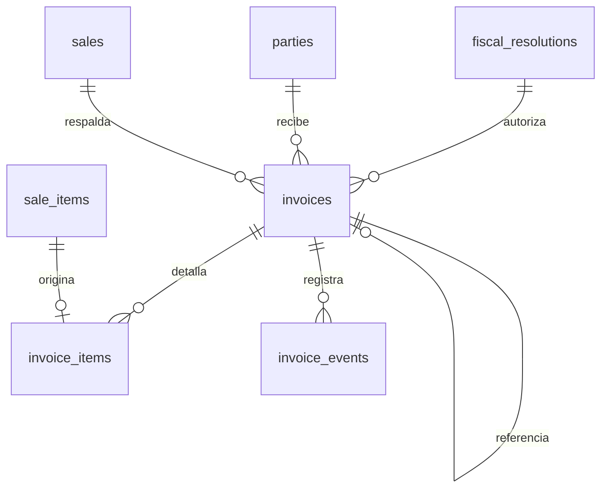

El documento maestro es explícito: se desarrolla la parte técnica internamente, dejando
preparado el espacio para firma, transmisión, validación y respuestas, y el área legal
maneja lo jurídico. El diseño refleja eso: la estructura de datos está completa, los
campos de firma y transmisión existen, y el módulo queda desacoplado de ventas.

### 11.1 `fiscal_resolutions`

| Columna | Tipo | Nulo | Restricción / Nota |
|---|---|---|---|
| `id` | BIGINT | NO | PK |
| `resolution_number` | VARCHAR(40) | NO | Número de la resolución DIAN |
| `document_type` | VARCHAR(30) | NO | CHECK IN (`FACTURA_VENTA`,`NOTA_CREDITO`,`NOTA_DEBITO`,`DOCUMENTO_SOPORTE`,`NOMINA`) |
| `prefix` | VARCHAR(10) | NO | Prefijo autorizado |
| `range_from` | BIGINT | NO | Consecutivo inicial autorizado |
| `range_to` | BIGINT | NO | Consecutivo final autorizado |
| `current_number` | BIGINT | NO | Último consecutivo usado |
| `technical_key` | VARCHAR(255) | SÍ | Clave técnica entregada por la DIAN |
| `valid_from` | DATE | NO | |
| `valid_to` | DATE | NO | Las resoluciones sí tienen vencimiento |
| `environment` | VARCHAR(15) | NO | CHECK IN (`HABILITACION`,`PRODUCCION`). DEFAULT `HABILITACION` |
| `is_active` | BOOLEAN | NO | DEFAULT TRUE |
| `notes` | TEXT | SÍ | |
| Auditoría | | | Completa |

Restricciones: UNIQUE(`prefix`, `document_type`, `resolution_number`); CHECK `range_to >
range_from`; CHECK `current_number >= range_from - 1 AND current_number <= range_to`.

`environment` está separado porque el proceso de habilitación ante la DIAN exige emitir
documentos de prueba antes de producción, y esos consecutivos no pueden mezclarse con los
reales.

`current_number` se incrementa con bloqueo de fila (`SELECT ... FOR UPDATE`) para
garantizar que no haya huecos ni duplicados en el consecutivo, que es una obligación
fiscal, no una preferencia técnica.

### 11.2 `invoices`

| Columna | Tipo | Nulo | Restricción / Nota |
|---|---|---|---|
| `id` | BIGINT | NO | PK |
| `document_type` | VARCHAR(30) | NO | CHECK IN (`FACTURA_VENTA`,`NOTA_CREDITO`,`NOTA_DEBITO`,`DOCUMENTO_SOPORTE`) |
| `resolution_id` | BIGINT | SÍ | FK → `fiscal_resolutions.id`, ON DELETE RESTRICT |
| `prefix` | VARCHAR(10) | NO | |
| `consecutive` | BIGINT | NO | |
| `full_number` | VARCHAR(30) | NO | UNIQUE. `prefix || consecutive` |
| `sale_id` | BIGINT | SÍ | FK → `sales.id`, ON DELETE RESTRICT. NULL en documento soporte |
| `purchase_id` | BIGINT | SÍ | FK → `purchases.id`, ON DELETE RESTRICT. Para documento soporte |
| `party_id` | BIGINT | NO | FK → `parties.id`, ON DELETE RESTRICT |
| `related_invoice_id` | BIGINT | SÍ | FK → `invoices.id`. La factura que la nota afecta |
| `issue_date` | DATE | NO | |
| `issue_time` | TIME WITH TIME ZONE | SÍ | La DIAN exige hora de emisión |
| `due_date` | DATE | SÍ | |
| `currency` | CHAR(3) | NO | DEFAULT `'COP'` |
| `subtotal` | NUMERIC(16,2) | NO | DEFAULT 0 |
| `discount_total` | NUMERIC(16,2) | NO | DEFAULT 0 |
| `tax_total` | NUMERIC(16,2) | NO | DEFAULT 0 |
| `withholding_total` | NUMERIC(16,2) | NO | DEFAULT 0 |
| `total` | NUMERIC(16,2) | NO | DEFAULT 0 |
| `payment_means` | VARCHAR(20) | SÍ | Medio de pago en formato DIAN |
| `payment_form` | VARCHAR(20) | SÍ | CHECK IN (`CONTADO`,`CREDITO`) |
| `cufe` | VARCHAR(200) | SÍ | Código Único de Factura Electrónica. UNIQUE cuando no es NULL |
| `uuid` | VARCHAR(100) | SÍ | Identificador del documento |
| `qr_data` | TEXT | SÍ | Contenido del código QR |
| `xml_signed` | TEXT | SÍ | XML UBL firmado |
| `xml_path` | VARCHAR(255) | SÍ | Ruta del archivo almacenado |
| `pdf_path` | VARCHAR(255) | SÍ | Representación gráfica |
| `dian_status` | VARCHAR(25) | NO | CHECK IN (`DRAFT`,`GENERATED`,`SIGNED`,`SENT`,`ACCEPTED`,`REJECTED`,`CANCELLED`). DEFAULT `DRAFT` |
| `dian_track_id` | VARCHAR(100) | SÍ | Identificador de seguimiento |
| `dian_response` | JSONB | SÍ | Respuesta completa del servicio |
| `dian_errors` | JSONB | SÍ | Errores de validación devueltos |
| `sent_at` | TIMESTAMPTZ | SÍ | |
| `accepted_at` | TIMESTAMPTZ | SÍ | |
| `email_sent_at` | TIMESTAMPTZ | SÍ | Envío al adquiriente |
| `notes` | TEXT | SÍ | |
| Auditoría | | | Completa |

Restricciones:

- UNIQUE(`prefix`, `consecutive`, `document_type`)
- Índice único parcial en `cufe` WHERE `cufe IS NOT NULL`
- CHECK: `document_type NOT IN ('NOTA_CREDITO','NOTA_DEBITO') OR related_invoice_id IS NOT NULL`
- CHECK: `document_type <> 'DOCUMENTO_SOPORTE' OR purchase_id IS NOT NULL`
- CHECK: `document_type = 'DOCUMENTO_SOPORTE' OR sale_id IS NOT NULL`

Índices: `ix_invoices_party`(`party_id`, `issue_date` DESC);
`ix_invoices_dian_status`(`dian_status`); `ix_invoices_sale`(`sale_id`);
`ix_invoices_issue_date`(`issue_date` DESC).

**Notas de diseño.** El estado `dian_status` como máquina de estados explícita permite
reintentar transmisiones fallidas sin ambigüedad y saber en cualquier momento qué
documentos están pendientes de aceptación. `dian_errors` en `JSONB` guarda la respuesta
literal del rechazo, que es lo único que sirve para depurar.

`DOCUMENTO_SOPORTE` con `purchase_id` cubre las compras a campesinos no obligados a
facturar, caso que aparece explícitamente en el Avance del ERD y que ninguna de las
versiones anteriores del modelo contemplaba.

Los totales se materializan y no se recalculan: una factura emitida es inmutable, y ese
es justamente el punto de la facturación electrónica.

### 11.3 `invoice_items`

| Columna | Tipo | Nulo | Restricción / Nota |
|---|---|---|---|
| `id` | BIGINT | NO | PK |
| `invoice_id` | BIGINT | NO | FK → `invoices.id`, ON DELETE CASCADE |
| `line_no` | SMALLINT | NO | |
| `sale_item_id` | BIGINT | SÍ | FK → `sale_items.id`, ON DELETE SET NULL |
| `purchase_item_id` | BIGINT | SÍ | FK → `purchase_items.id`, ON DELETE SET NULL |
| `product_id` | BIGINT | SÍ | FK → `products.id`, ON DELETE RESTRICT |
| `description` | VARCHAR(255) | NO | Snapshot obligatorio: la factura debe ser autocontenida |
| `product_code` | VARCHAR(40) | SÍ | SKU snapshot |
| `quantity` | NUMERIC(16,4) | NO | CHECK > 0 |
| `unit_id` | BIGINT | SÍ | FK → `units_of_measure.id` |
| `unit_dian_code` | VARCHAR(10) | SÍ | Snapshot del código UNECE |
| `unit_price` | NUMERIC(16,4) | NO | |
| `discount_amount` | NUMERIC(16,2) | NO | DEFAULT 0 |
| `tax_code` | VARCHAR(20) | SÍ | Snapshot |
| `tax_rate` | NUMERIC(9,6) | NO | DEFAULT 0 |
| `tax_amount` | NUMERIC(16,2) | NO | DEFAULT 0 |
| `subtotal` | NUMERIC(16,2) | NO | |
| `total` | NUMERIC(16,2) | NO | |
| Auditoría | | | `created_at`, `updated_at` |

Restricción: UNIQUE(`invoice_id`, `line_no`).

Todos los campos son snapshots, incluida la descripción y el código de unidad. Una
factura debe poder reimprimirse idéntica en cinco años aunque el producto se haya
renombrado o descontinuado. Por eso `product_id` es nulable y `description` no lo es.

### 11.4 `invoice_events`

Bitácora de la interacción con la DIAN. Tabla append-only.

| Columna | Tipo | Nulo | Restricción / Nota |
|---|---|---|---|
| `id` | BIGINT | NO | PK |
| `invoice_id` | BIGINT | NO | FK → `invoices.id`, ON DELETE CASCADE |
| `event_type` | VARCHAR(30) | NO | CHECK IN (`GENERATED`,`SIGNED`,`SENT`,`ACCEPTED`,`REJECTED`,`EMAILED`,`CANCELLED`,`RETRY`,`ERROR`) |
| `status_before` | VARCHAR(25) | SÍ | |
| `status_after` | VARCHAR(25) | SÍ | |
| `payload` | JSONB | SÍ | Petición o respuesta completa |
| `message` | TEXT | SÍ | |
| `occurred_at` | TIMESTAMPTZ | NO | DEFAULT now() |
| `created_by_id` | BIGINT | SÍ | FK → `users.id` |

Índice: `ix_invoice_events_invoice`(`invoice_id`, `occurred_at`).

Esta tabla es la que hace auditable el módulo. Cuando la DIAN rechaza un documento y hay
que explicar qué pasó, la bitácora completa de intentos, respuestas y reintentos es la
única evidencia utilizable.

---

## 12. Módulo Logística

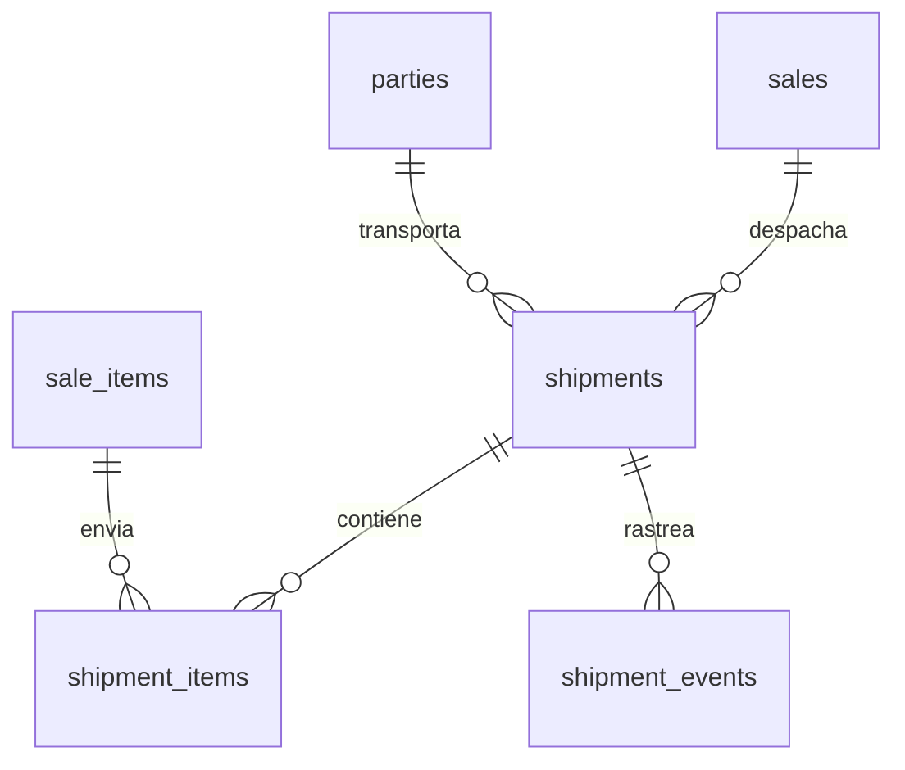

Recupera el módulo `SHIPMENTS / LOGISTICS` del ERD conceptual, que había desaparecido del
avance.

### 12.1 `shipments`

| Columna | Tipo | Nulo | Restricción / Nota |
|---|---|---|---|
| `id` | BIGINT | NO | PK |
| `shipment_number` | VARCHAR(30) | NO | UNIQUE |
| `sale_id` | BIGINT | SÍ | FK → `sales.id`, ON DELETE RESTRICT |
| `carrier_party_id` | BIGINT | SÍ | FK → `parties.id`, ON DELETE RESTRICT. Rol `CARRIER` |
| `carrier_name` | VARCHAR(120) | SÍ | Para transportadores ocasionales sin registro |
| `shipment_type` | VARCHAR(25) | NO | CHECK IN (`SALE_DELIVERY`,`PROCESSOR_OUT`,`PROCESSOR_IN`,`TRANSFER`,`RETURN`) |
| `origin_location_id` | BIGINT | SÍ | FK → `inventory_locations.id`, ON DELETE RESTRICT |
| `destination_location_id` | BIGINT | SÍ | FK → `inventory_locations.id`, ON DELETE RESTRICT |
| `destination_address_id` | BIGINT | SÍ | FK → `addresses.id`, ON DELETE SET NULL |
| `tracking_number` | VARCHAR(80) | SÍ | |
| `tracking_url` | VARCHAR(255) | SÍ | |
| `status` | VARCHAR(25) | NO | CHECK IN (`PENDING`,`DISPATCHED`,`IN_TRANSIT`,`DELIVERED`,`FAILED`,`RETURNED`,`CANCELLED`). DEFAULT `PENDING` |
| `dispatched_at` | TIMESTAMPTZ | SÍ | |
| `estimated_delivery_date` | DATE | SÍ | |
| `delivered_at` | TIMESTAMPTZ | SÍ | |
| `received_by` | VARCHAR(150) | SÍ | Quién recibió |
| `total_weight_kg` | NUMERIC(16,4) | SÍ | |
| `package_count` | SMALLINT | SÍ | |
| `freight_cost` | NUMERIC(16,2) | NO | DEFAULT 0. Lo que Densa Niebla paga |
| `freight_charged` | NUMERIC(16,2) | NO | DEFAULT 0. Lo que cobra al cliente |
| `insurance_cost` | NUMERIC(16,2) | NO | DEFAULT 0 |
| `currency` | CHAR(3) | NO | DEFAULT `'COP'` |
| `carrier_document_number` | VARCHAR(60) | SÍ | Guía o remesa |
| `notes` | TEXT | SÍ | |
| Auditoría | | | Completa |

Restricciones: CHECK `origin_location_id IS NULL OR destination_location_id IS NULL OR
origin_location_id <> destination_location_id`.

Índices: `ix_shipments_sale`(`sale_id`); `ix_shipments_status`(`status`);
`ix_shipments_carrier`(`carrier_party_id`); `ix_shipments_tracking`(`tracking_number`).

Los tipos `PROCESSOR_OUT` y `PROCESSOR_IN` conectan este módulo con la maquila: el envío
del café verde al trillador y su retorno son despachos reales con costo de flete, y
frecuentemente ese flete se olvida al costear la maquila. Con esta estructura queda
registrado y se puede imputar vía `cost_entries`.

La distinción `freight_cost` / `freight_charged` permite ver si el flete cobrado cubre el
pagado, que en venta a domicilio suele ser una fuga de margen invisible.

### 12.2 `shipment_items`

| Columna | Tipo | Nulo | Restricción / Nota |
|---|---|---|---|
| `id` | BIGINT | NO | PK |
| `shipment_id` | BIGINT | NO | FK → `shipments.id`, ON DELETE CASCADE |
| `sale_item_id` | BIGINT | SÍ | FK → `sale_items.id`, ON DELETE RESTRICT |
| `product_id` | BIGINT | NO | FK → `products.id`, ON DELETE RESTRICT |
| `batch_id` | BIGINT | SÍ | FK → `batches.id`, ON DELETE RESTRICT |
| `quantity` | NUMERIC(16,4) | NO | CHECK > 0 |
| `unit_id` | BIGINT | NO | FK → `units_of_measure.id` |
| `quantity_base` | NUMERIC(16,4) | NO | |
| `movement_id` | BIGINT | SÍ | FK → `inventory_movements.id`, ON DELETE SET NULL |
| Auditoría | | | `created_at`, `updated_at` |

Permite despachos parciales: una venta de 100 libras puede salir en dos envíos, y cada
uno registra qué lotes llevó.

### 12.3 `shipment_events`

| Columna | Tipo | Nulo | Restricción / Nota |
|---|---|---|---|
| `id` | BIGINT | NO | PK |
| `shipment_id` | BIGINT | NO | FK → `shipments.id`, ON DELETE CASCADE |
| `event_type` | VARCHAR(30) | NO | CHECK IN (`CREATED`,`DISPATCHED`,`IN_TRANSIT`,`OUT_FOR_DELIVERY`,`DELIVERED`,`FAILED`,`RETURNED`,`NOTE`) |
| `location_text` | VARCHAR(150) | SÍ | |
| `message` | TEXT | SÍ | |
| `occurred_at` | TIMESTAMPTZ | NO | DEFAULT now() |
| `created_by_id` | BIGINT | SÍ | FK → `users.id` |

---

## 13. Módulo Gastos

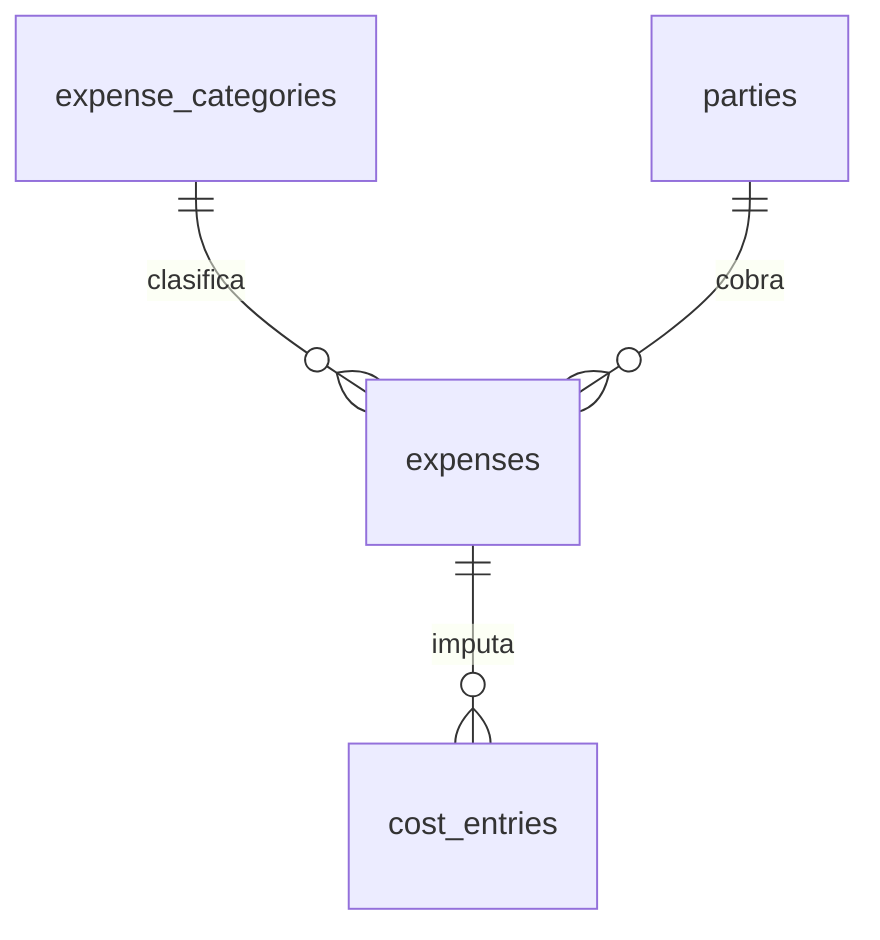

### 13.1 `expense_categories`

| Columna | Tipo | Nulo | Restricción / Nota |
|---|---|---|---|
| `id` | BIGINT | NO | PK |
| `code` | VARCHAR(30) | NO | UNIQUE |
| `name` | VARCHAR(100) | NO | |
| `parent_id` | BIGINT | SÍ | FK → `expense_categories.id`, ON DELETE RESTRICT |
| `expense_nature` | VARCHAR(25) | NO | CHECK IN (`OPERATIONAL`,`ADMINISTRATIVE`,`SALES`,`FINANCIAL`,`TAX`,`OTHER`) |
| `is_cost_of_sales` | BOOLEAN | NO | DEFAULT FALSE. TRUE = genera `cost_entries` |
| `default_cost_category_id` | BIGINT | SÍ | FK → `cost_categories.id`, ON DELETE SET NULL |
| `is_active` | BOOLEAN | NO | DEFAULT TRUE |
| Auditoría | | | Completa |

### 13.2 `expenses`

| Columna | Tipo | Nulo | Restricción / Nota |
|---|---|---|---|
| `id` | BIGINT | NO | PK |
| `expense_number` | VARCHAR(30) | NO | UNIQUE |
| `category_id` | BIGINT | NO | FK → `expense_categories.id`, ON DELETE RESTRICT |
| `party_id` | BIGINT | SÍ | FK → `parties.id`, ON DELETE RESTRICT |
| `expense_date` | DATE | NO | |
| `accounting_date` | DATE | NO | |
| `description` | VARCHAR(255) | NO | |
| `subtotal` | NUMERIC(16,2) | NO | CHECK >= 0 |
| `tax_amount` | NUMERIC(16,2) | NO | DEFAULT 0 |
| `withholding_amount` | NUMERIC(16,2) | NO | DEFAULT 0 |
| `total` | NUMERIC(16,2) | NO | |
| `currency` | CHAR(3) | NO | DEFAULT `'COP'` |
| `payment_method` | VARCHAR(25) | SÍ | Mismo catálogo que `payments.method` |
| `payment_status` | VARCHAR(20) | NO | CHECK IN (`UNPAID`,`PARTIAL`,`PAID`). DEFAULT `UNPAID` |
| `document_type` | VARCHAR(30) | SÍ | CHECK IN (`FACTURA`,`DOCUMENTO_SOPORTE`,`RECIBO`,`NOMINA`,`NINGUNO`) |
| `document_number` | VARCHAR(40) | SÍ | |
| `is_capitalizable` | BOOLEAN | NO | DEFAULT FALSE. Compra de activo, no gasto |
| `is_recurring` | BOOLEAN | NO | DEFAULT FALSE |
| `attachment_path` | VARCHAR(255) | SÍ | Soporte escaneado |
| `notes` | TEXT | SÍ | |
| Auditoría | | | Completa |

Índices: `ix_expenses_category_date`(`category_id`, `accounting_date`);
`ix_expenses_party`(`party_id`); `ix_expenses_accounting_date`(`accounting_date` DESC).

La conexión con costos es unidireccional y explícita: si
`expense_categories.is_cost_of_sales = TRUE`, el servicio crea automáticamente el
`cost_entry` correspondiente con la categoría de costo por defecto. Si es FALSE, el gasto
solo afecta el resultado del período. Así se evita el error clásico de contar dos veces
un mismo desembolso: una vez como costo del producto y otra como gasto operativo.

`is_capitalizable` está pensado para el escenario del ERD conceptual donde Densa Niebla
compra una tostadora: eso no es gasto del mes, es un activo que se deprecia y cuya
depreciación entra al costo de la tostión vía `cost_rules` de tipo `INTERNAL`.

---

## 14. Módulo Configuración

### 14.1 `app_settings`

| Columna | Tipo | Nulo | Restricción / Nota |
|---|---|---|---|
| `id` | BIGINT | NO | PK |
| `key` | VARCHAR(60) | NO | UNIQUE |
| `value` | TEXT | SÍ | |
| `value_type` | VARCHAR(20) | NO | CHECK IN (`STRING`,`INTEGER`,`DECIMAL`,`BOOLEAN`,`DATE`,`JSON`) |
| `group_name` | VARCHAR(40) | SÍ | Para agrupar en la interfaz |
| `description` | TEXT | SÍ | |
| `is_editable` | BOOLEAN | NO | DEFAULT TRUE |
| `changed_at` | TIMESTAMPTZ | SÍ | Último cambio de valor |
| Auditoría | | | Completa |

Claves iniciales necesarias:

| `key` | Tipo | Propósito |
|---|---|---|
| `default_costing_method` | STRING | `WEIGHTED_AVERAGE` o `SPECIFIC_BATCH` |
| `costing_method_changed_at` | DATE | Fecha del último cambio de política, para explicar quiebres en la serie |
| `allow_negative_stock` | BOOLEAN | Política global, sobreescribible por ubicación |
| `freight_allocation_basis` | STRING | `VALUE` o `WEIGHT` |
| `byproduct_cost_allocation` | STRING | `NONE`, `MARKET_VALUE` o `MANUAL` |
| `default_currency` | STRING | `COP` |
| `rounding_mode` | STRING | `HALF_UP` |
| `company_nit` | STRING | Para el XML de facturación |
| `company_legal_name` | STRING | |
| `dian_environment` | STRING | `HABILITACION` o `PRODUCCION` |
| `waste_tolerance_pct` | DECIMAL | Umbral para alertar mermas anómalas |

### 14.2 `document_sequences`

| Columna | Tipo | Nulo | Restricción / Nota |
|---|---|---|---|
| `id` | BIGINT | NO | PK |
| `code` | VARCHAR(30) | NO | UNIQUE. `SALE`, `PURCHASE`, `PRODUCTION_ORDER`, `SHIPMENT`, `PAYMENT`, `EXPENSE` |
| `prefix` | VARCHAR(10) | SÍ | |
| `pattern` | VARCHAR(40) | NO | Ej. `{prefix}-{year}-{number:04d}` |
| `next_number` | BIGINT | NO | DEFAULT 1 |
| `resets_yearly` | BOOLEAN | NO | DEFAULT TRUE |
| `current_year` | SMALLINT | SÍ | |
| Auditoría | | | Completa |

Los consecutivos internos se generan aquí, no con `id` de la tabla. La razón: el `id` es
un detalle de implementación que puede tener huecos por transacciones abortadas, y un
número de documento con huecos genera preguntas incómodas. La obtención del siguiente
número usa `SELECT ... FOR UPDATE` sobre la fila.

Los consecutivos **fiscales** no se manejan aquí: viven en `fiscal_resolutions`, porque
están sujetos a rangos autorizados y a reglas distintas.
---

## 15. Resumen de índices

Los índices que se crean explícitamente, más allá de los automáticos de PK y UNIQUE.
Alembic no los genera solo: hay que declararlos en los modelos.

### Críticos para rendimiento

| Tabla | Índice | Uso |
|---|---|---|
| `inventory_movements` | (`product_id`, `batch_id`, `location_id`, `occurred_at`) | Cálculo de saldos. El más importante del sistema |
| `inventory_movements` | (`occurred_at` DESC) | Kardex y reportes por período |
| `inventory_movements` | (`reference_type`, `reference_id`) | Auditoría desde el documento origen |
| `inventory_balances` | UNIQUE(`product_id`, `batch_id`, `location_id`) | Consulta de stock del dashboard |
| `price_list_items` | (`price_list_id`, `product_id`, `valid_from`, `valid_to`) | Resolución de precio en cada línea de venta |
| `cost_rules` | (`applies_to`, `process_id`, `valid_from`, `valid_to`) | Resolución de costo de maquila |
| `cost_entries` | (`cost_object_type`, `cost_object_id`) | Costo total de una orden o lote |
| `sales` | (`sale_date` DESC) | Dashboard y estadísticas |
| `sales` | (`party_id`, `sale_date` DESC) | Historial de compras del cliente |
| `sale_item_batches` | (`batch_id`) | Trazabilidad hacia adelante |

### De filtrado frecuente

`parties`(`is_active`), `parties`(`document_number`), `party_roles`(`role_code`,
`valid_to`), `products`(`product_kind`), `products`(`is_active`), `batches`(`product_id`,
`status`), `batches`(`origin_party_id`), `production_orders`(`status`),
`process_executions`(`executor_party_id`, `status`), `invoices`(`dian_status`),
`shipments`(`status`), `payments`(`party_id`, `payment_date` DESC),
`expenses`(`accounting_date` DESC).

### Índices únicos parciales

Requieren declaración explícita en SQLAlchemy con `postgresql_where`:

```python
Index("uq_addresses_one_primary", "party_id",
      unique=True, postgresql_where=text("is_primary"))

Index("uq_uom_one_base_per_dimension", "dimension",
      unique=True, postgresql_where=text("is_base_for_dimension"))

Index("uq_price_lists_one_default", "channel",
      unique=True, postgresql_where=text("is_default AND is_active"))

Index("uq_inventory_balances_no_batch", "product_id", "location_id",
      unique=True, postgresql_where=text("batch_id IS NULL"))

Index("uq_products_barcode", "barcode",
      unique=True, postgresql_where=text("barcode IS NOT NULL"))

Index("uq_invoices_cufe", "cufe",
      unique=True, postgresql_where=text("cufe IS NOT NULL"))
```

### Recomendación diferida

No crear índices de texto (`pg_trgm` para búsqueda por nombre) en la migración inicial.
Se agregan cuando haya volumen real y se sepa qué se busca. Un índice de más cuesta en
cada escritura.

---

## 16. Decisiones cerradas y decisiones abiertas

### 16.1 Decisiones cerradas en esta versión

| Decisión | Resolución | Origen |
|---|---|---|
| Clientes / cafeterías / intermediarios | Una sola tabla `parties` con `party_roles` | ERD conceptual |
| Trazabilidad por lote en la venta | `sale_item_batches` incluida desde el inicio | Tu decisión |
| Método de costeo | Ambos, configurable por producto con default global | Tu decisión |
| Inventario | Libro append-only + tabla de saldos derivada | Avance del ERD |
| Maquila reversible | `executor_type` + `executor_party_id` en `process_executions` | ERD conceptual |
| Unidad de costo configurable | `cost_rules.unit_id` + `calculation_basis` | ERD conceptual |
| Historial de tarifas | `valid_from` / `valid_to` + EXCLUDE de solapamiento | ERD conceptual |
| Venta vs. factura | Entidades separadas, relación opcional | Pregunta abierta del Avance |
| Merma | Tipificada, con recuperabilidad y tratamiento de costo | Pregunta abierta del Avance |
| Costos directos vs. indirectos | Configurable en `cost_categories.nature` | Pregunta abierta del Avance |
| Conversión de unidades | `unit_conversions` con factores universales y por producto | Vacío detectado |
| Compras | Módulo `purchases` + `purchase_items` creado | Vacío detectado |
| Café en poder de terceros | Ubicación tipo `PROCESSOR` | Vacío detectado |
| Enums | `VARCHAR` + `CHECK`, no `ENUM` nativo | Criterio técnico |
| Nombres divergentes | Glosario canónico en la sección 0.1 | Inconsistencia detectada |

### 16.2 Decisiones que requieren validación de negocio

Estas no las puede resolver el diseño técnico. Cada una tiene una **propuesta por
defecto** implementada, de modo que el desarrollo no se bloquea, pero conviene
confirmarlas antes de cargar datos reales.

**Factores de conversión del sector.** El modelo asume 1 arroba = 12.5 kg, 1 carga =
125 kg, 1 saco = 70 kg. En la práctica regional estas equivalencias varían según si se
habla de pergamino, verde o excelso, y el saco de uso interno suele ser de 60 kg. Es un
dato de negocio: hay que confirmar cuáles usa Densa Niebla en la compra a campesinos.

**Rendimientos esperados por proceso.** Los valores de `expected_yield_pct` propuestos
(trilla ~80%, tostión ~83%) son órdenes de magnitud del sector. Los reales dependen del
café y del maquilador. Se cargan como parámetro y se ajustan con datos propios.

**Tarifas de impuestos aplicables al café.** El modelo tiene la estructura completa
(`taxes` con vigencias) pero no presume tarifas. Si el café tostado está gravado, exento
o excluido, y con qué porcentaje según presentación, lo define el área legal. Es
bloqueante solo para facturación, no para el resto del ERP.

**Tratamiento de la pasilla y la cascarilla.** El modelo permite tres políticas
(`byproduct_cost_allocation`: `NONE`, `MARKET_VALUE`, `MANUAL`). La elección afecta
directamente el costo unitario del producto principal y por tanto el precio mínimo
viable. Es una decisión contable con impacto comercial.

**Distribución del flete de entrada.** Por valor o por peso (`freight_allocation_basis`).
Con café de precios muy distintos por finca, la diferencia es material.

**Retención en la fuente en compras a campesinos.** El campo existe
(`purchases.withholding_total`) pero las tarifas y los umbrales los define el área
contable.

**Método de costeo por defecto.** La recomendación técnica es arrancar en
`WEIGHTED_AVERAGE` para toda la operación y marcar como `SPECIFIC_BATCH` únicamente los
microlotes y cafés de origen único que se vendan como tal. Promedio ponderado tolera el
registro imperfecto de los primeros meses; costo por lote exige rigor desde el día uno.

**Umbral de merma anómala.** `waste_tolerance_pct` define cuándo el sistema alerta. Sin
datos históricos, se sugiere arrancar en un desvío de 5 puntos sobre el rendimiento
esperado y ajustar.

### 16.3 Decisiones técnicas deliberadamente diferidas

No entran en la migración inicial, y eso es intencional:

**Contabilidad de doble partida.** El modelo captura costos, gastos, ventas y pagos, pero
no lleva libro contable con débitos y créditos. Añadirlo es un módulo completo
(`accounts`, `journal_entries`, `journal_lines`) y hoy no es el problema. El diseño no lo
impide: `cost_entries` y `expenses` tienen `accounting_date`, que es el gancho natural.

**Multi-moneda real.** Existe `currency` en todas las tablas con monto, pero no hay tabla
de tasas de cambio. Si se exporta, se agrega `exchange_rates` y una columna
`exchange_rate` en los documentos. La preparación está hecha; la implementación no.

**Multi-empresa.** No hay `company_id`. Si algún día hay dos razones sociales, es una
migración grande. Se asume una sola empresa.

**Órdenes de compra y de venta separadas del documento.** Hoy `purchases` y `sales` con
estado `DRAFT` cubren la función de pedido. Si el flujo crece, se separan.

**Permisos granulares.** `roles.permissions` en JSONB en lugar de matriz relacional. Ver
sección 2.2.

**Índices de texto completo.** Ver sección 15.

---

## 17. Orden de la migración inicial

La migración inicial no debe ser un solo archivo de 50 tablas. Se propone dividirla en
seis migraciones encadenadas, para que cada una sea revisable y reversible por separado.

### Migración 1 — Extensiones y catálogos base

```
CREATE EXTENSION btree_gist
users, roles, user_roles
units_of_measure, unit_conversions
product_categories, taxes
cost_categories, expense_categories
production_processes
app_settings, document_sequences
```

Sin dependencias externas. Es la migración más segura y la que permite verificar que la
convención de nombres y los tipos quedaron bien antes de seguir.

Nota: `unit_conversions.product_id` referencia `products`, que aún no existe. Se crea la
tabla sin esa FK y se agrega en la migración 2, o se mueve `unit_conversions` a la
migración 2. Se prefiere la segunda opción por claridad.

### Migración 2 — Terceros y productos

```
parties, party_roles, addresses, party_contacts
products, coffee_profiles, unit_conversions
inventory_locations
```

Aquí aparece la primera dependencia circular a resolver: `parties.default_price_list_id`
apunta a `price_lists`, que se crea en la migración 3. La FK se agrega al final de la
migración 3 con `op.create_foreign_key`, no en la definición inicial de la tabla. Es un
patrón normal en Alembic y hay que dejarlo escrito para no pelearse con el autogenerate.

También: `users.party_id` → `parties.id` se agrega aquí, no en la migración 1.

### Migración 3 — Precios y comisiones

```
price_lists, price_list_items
party_price_rules
intermediary_fee_rules
+ FK parties.default_price_list_id
+ EXCLUDE de solapamiento en price_list_items
```

### Migración 4 — Compras, inventario y producción

```
purchases, purchase_items
batches, batch_lineage
inventory_movements, inventory_balances
production_orders, process_executions
production_inputs, production_outputs, production_waste
```

La migración más grande y la que hay que revisar con más cuidado. Contiene las
autorreferencias de `inventory_movements` (`counterpart_movement_id`,
`reverses_movement_id`) y de `batch_lineage`, que el autogenerate de Alembic suele
ordenar mal.

Dependencia circular: `batches.purchase_item_id` ↔ `purchase_items.batch_id`. Se crean
ambas tablas y una de las dos FK se agrega después, dentro de la misma migración.

### Migración 5 — Costos, ventas y pagos

```
cost_rules, cost_entries
+ EXCLUDE de solapamiento en cost_rules
sales, sale_items, sale_item_batches
payments, payment_allocations
intermediary_fee_entries
expenses
```

### Migración 6 — Facturación y logística

```
fiscal_resolutions, invoices, invoice_items, invoice_events
shipments, shipment_items, shipment_events
```

Los dos módulos más desacoplados van al final, que es coherente con el principio del
documento maestro de mantener la facturación separada.

### Datos semilla

Después de la migración 6, un comando de siembra (`flask seed initial`) debe cargar:

- Roles del sistema (6 filas)
- Unidades de medida (9 filas) y conversiones universales
- Los cinco procesos de producción
- Categorías de costo y de gasto iniciales
- Ubicación de inventario `BODEGA_PRINCIPAL` y `SCRAP`
- Las claves de `app_settings`
- Los consecutivos de `document_sequences`
- Un usuario administrador inicial

La siembra **no va en las migraciones**. Va en un comando CLI idempotente. Meter
`INSERT` de datos maestros en una migración de Alembic mezcla esquema con contenido y
complica cualquier reversión.

### Verificación posterior

Después de aplicar las seis migraciones en local:

```powershell
python verificar_entorno.py
flask db upgrade
flask db downgrade base   # verificar que todo se puede revertir
flask db upgrade          # volver a aplicar
psql -U densa_dev -d densa_niebla_dev -c "\dt"
psql -U densa_dev -d densa_niebla_dev -c "\d inventory_movements"
```

El `downgrade base` seguido de `upgrade` es la prueba que realmente importa: si las
migraciones no se pueden revertir, no hay plan de rollback en producción.

---

## 18. Estructura de archivos resultante

```
app/models/
    __init__.py           # importa todos los modelos para Alembic
    base.py               # Base declarativa, naming_convention, mixins
    mixins.py             # TimestampMixin, AuditMixin
    user.py               # users, roles, user_roles
    party.py              # parties, party_roles, addresses, party_contacts
    product.py            # products, product_categories, coffee_profiles
    unit.py               # units_of_measure, unit_conversions
    tax.py                # taxes
    price.py              # price_lists, price_list_items, party_price_rules
    intermediary.py       # intermediary_fee_rules, intermediary_fee_entries
    purchase.py           # purchases, purchase_items
    inventory.py          # inventory_locations, inventory_movements, inventory_balances
    batch.py              # batches, batch_lineage
    production.py         # production_orders, production_processes, process_executions,
                          # production_inputs, production_outputs, production_waste
    cost.py               # cost_categories, cost_rules, cost_entries
    sale.py               # sales, sale_items, sale_item_batches
    payment.py            # payments, payment_allocations
    invoice.py            # fiscal_resolutions, invoices, invoice_items, invoice_events
    shipment.py           # shipments, shipment_items, shipment_events
    expense.py            # expense_categories, expenses
    setting.py            # app_settings, document_sequences
```

Dieciocho archivos de modelos más tres de infraestructura. Difiere de la lista tentativa
del documento maestro porque esa lista era anterior al ERD: `customer.py` desaparece
(absorbido por `party.py`), y aparecen `unit.py`, `batch.py`, `purchase.py`,
`intermediary.py`, `shipment.py` y `setting.py`.

Servicios correspondientes, donde vive la lógica que las restricciones de base de datos no
pueden expresar:

```
app/services/
    costing.py            # resolve_outbound_cost, promedio ponderado, costo por lote
    inventory.py          # crear movimientos, validar saldos, reconstruir balances
    pricing.py            # resolución de precio segun la seccion 5.3
    production.py         # cerrar ordenes, calcular rendimientos y costos
    sales.py              # confirmar venta, asignar lotes, calcular margen
    units.py              # conversion entre unidades
    numbering.py          # consecutivos internos y fiscales
    invoicing.py          # generación de XML, firma, transmisión DIAN
```

`costing.py` y `units.py` son los dos que deben escribirse primero y con pruebas, porque
todo lo demás depende de que estén bien.

---

## 19. Estado y siguiente paso

**Versión:** ERD lógico v1.0
**Entidades:** 50 tablas en 13 módulos
**Estado:** listo para revisión

Cambios estructurales frente al ERD conceptual v1 y el Avance:

- Se agregó el módulo de **compras**, que no existía y sin el cual el costeo no tiene origen
- Se agregó **conversión de unidades**, que faltaba y sin la cual inventario y costo divergen
- Se recuperaron **logística**, **comisiones de intermediario**, **pagos** y **gastos**, que estaban en el conceptual y habían desaparecido del avance
- Se agregó **`sale_item_batches`** por decisión explícita
- Se agregó **costeo dual configurable** por decisión explícita
- Se agregó la **ubicación tipo `PROCESSOR`** para el café en poder de maquiladores
- Se agregó **`batch_lineage`** N:N en lugar de un padre único, para soportar blends
- Se agregó **`invoice_events`** y **`fiscal_resolutions`** para el flujo real de la DIAN
- Se unificó el **glosario de nombres** divergentes

Siguiente paso: revisar este documento y aprobarlo o marcar ajustes. Con la aprobación, se
escriben los modelos SQLAlchemy en el orden de la sección 17, empezando por `base.py`,
`mixins.py` y la migración 1.

Recomendación de secuencia para tener algo funcionando pronto: escribir y migrar los
módulos 1 a 4 (seguridad, terceros, productos, precios), construir la autenticación y los
CRUD de terceros y productos, y solo entonces seguir con inventario y producción. Así hay
una aplicación usable y probada antes de entrar a la parte más compleja del modelo.
